 # Enterprise Sales and Procurement Model (ESPM) Cloud Native

  ## Description

  **Enterprise Sales and Procurement Model** (ESPM) **Cloud Native** is a reference application to showcase how **Resilience patterns** can be implemented in a Cloud Native application. It is built based on microservices architecture principles. Each microservice is built as a [Spring Boot](https://spring.io/projects/spring-boot) application. The current scope of the application showcases the below resilience patterns.
  * *Retry*
  * *Timeout*
  * *Circuit Breaker*
  * *Bounded Queue*
  * *Shed Load*
  * *Unit Isolation*

  These patterns are showcased through implementing a business scenario of an eCommerce site that sells electronic products. The eCommerce site supports two personas

  1. A Customer, who can order Products
  2. A Retailer who can then accept the Sales Orders created by the customer. The Retailer can also update the Product Stock information.


  ## Table of Contents
  <!-- toc -->

- [Enterprise Sales and Procurement Model (ESPM) Cloud Native](#enterprise-sales-and-procurement-model-espm-cloud-native)
  - [Description](#description)
  - [Table of Contents](#table-of-contents)
  - [Architecture](#architecture)
      - [Retry](#retry)
      - [Timeout](#timeout)
      - [Circuit Breaker](#circuit-breaker)
      - [Bounded Queue](#bounded-queue)
      - [Shed load](#shed-load)
      - [Unit Isolation](#unit-isolation)
  - [REST API](#rest-api)
    - [Swagger API Definition](#swagger-api-definition)
      - [Customer Service](#customer-service)
      - [Product Service](#product-service)
      - [Sales Service](#sales-service)
  - [Requirements](#requirements)
    - [Message server](#message-server)
    - [SQL Database Server](#sql-database-server)
  - [Deploying the ESPM application locally](#deploying-the-espm-application-locally)
      - [Customer Service](#customer-service-1)
      - [Product Service](#product-service-1)
      - [Worker](#worker)
      - [Tax Service](#tax-service)
      - [Sales Service](#sales-service-1)
      - [Gateway](#gateway)
    - [Accessing the Local API Endpoints](#accessing-the-local-api-endpoints)
      - [Customer Service](#customer-service-2)
      - [Product Service](#product-service-2)
      - [Sales Service](#sales-service-2)
      - [Tax Service (External Service)](#tax-service-external-service)
      - [Test the ESPM Application Locally](#test-the-espm-application-locally)
  - [Deploying the ESPM application on Cloud Foundry](#deploying-the-espm-application-on-cloud-foundry)
    - [Security Implementation](#security-implementation)
    - [Configuring Enterprise Messaging](#configuring-enterprise-messaging)
    - [Tax Service Application Deployment](#tax-service-application-deployment)
      - [CF Manifest](#cf-manifest)
      - [Deploy Service](#deploy-service)
    - [Create Destination](#create-destination)
    - [Build and Deploy ESPM Application](#build-and-deploy-espm-application)
      - [Using CF manifest](#using-cf-manifest)
      - [Using CF deploy service](#using-cf-deploy-service)
  - [Running the Application](#running-the-application)
    - [Setup Role collections](#setup-role-collections)
    - [Assign Role to the user](#assign-role-to-the-user)
    - [Enterprise Message Queue creation](#enterprise-message-queue-creation)
    - [Acessing the application UI](#acessing-the-application-ui)
    - [Accessing the application API Endpoints](#accessing-the-application-api-endpoints)
      - [Customer Service](#customer-service-3)
      - [Product Service](#product-service-3)
      - [Sales Service](#sales-service-3)
  - [Resilience Patterns in action](#resilience-patterns-in-action)
    - [Retry](#retry-1)
    - [Timeout](#timeout-1)
    - [Bounded Queue](#bounded-queue-1)
    - [Unit Isolation](#unit-isolation-1)
    - [Circuit Breaker](#circuit-breaker-1)
    - [Shed Load](#shed-load)
  - [Known issues](#known-issues)
  - [Support](#support)
  - [License](#license)
<!-- tocstop -->


## Architecture
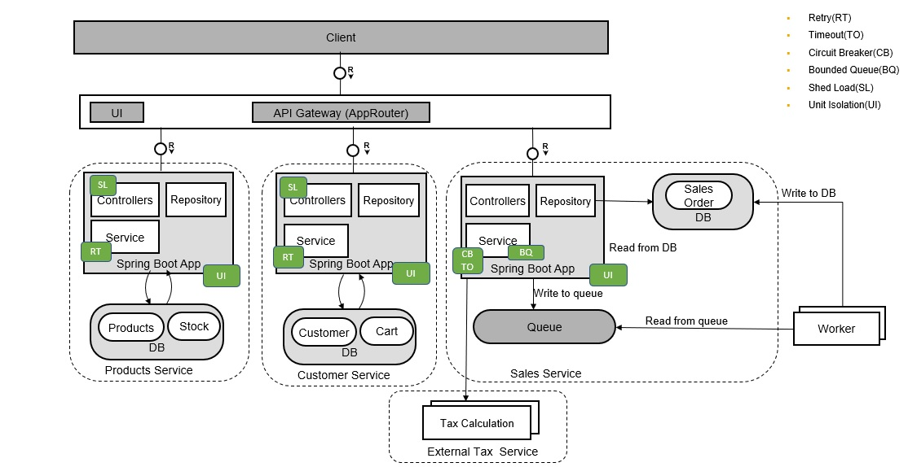


The ESPM applications consists of five microservices and one external service.
1. **Customer Service** - This service process Customer and Shopping cart information
2. **Product Service** - This service can be used to process products and stock information
3. **Sales Service** - Sales Orders are processed by this service. Each time a sales order is created, it’s not directly inserted into the database, but inserted into a queue. A background process called worker picks the message from queue and inserts to the database. The rationale behind this approach is explained later in the document. For read operation on sales order, its directly read from the database.
4. **Worker** - Background process which picks the Sales Order from the queue and inserts it into the database.
5. **Gateway** - It is an optional component and acts as entry point for the complete application. It also acts as a reverse proxy and routes the request to the appropriate microservice. The UI for the application is integrated into the Gateway module. Then UI of the application consists of two parts


   *Webshop*: An application where an authenticated Customer can buy products by creating Sales Order

   *Retailer*: An application where an authenticated and authorized Sales Manager known as Retailer can approve/reject sales orders. Only a user with retailer role will be able to access the end point.

6. **External Tax Service** - This is a service which is external to the application and used to do tax calculation. This Tax calculation service is provided, to be used along with the implementation of Circuit Breaker, Quarantine pattern. This service is also used in showcasing the app to app communication between two microservices deployed in the same subaccount, but bounded to two different Authorization and Trust Management services. For more information see  [referencing the application](https://help.sap.com/viewer/65de2977205c403bbc107264b8eccf4b/Cloud/en-US/517895a9612241259d6941dbf9ad81cb.html#loio517895a9612241259d6941dbf9ad81cb__section_fm2_wsk_pdb) in the documentation for SAP Cloud Platform.


A [Domain Driven Design](https://en.wikipedia.org/wiki/Domain-driven_design) approach was used to decide the capabilities of each microservices. The Customer and Cart entities are part of the Customer Microservice and Product and Stock entities are part of the Product Service. To keep things simple there is only one entity in Sales Service which is the Sales Order entity. In real world scenarios, Sales Entity might have Sales Order Header and Sales Order Line Items Entity and more. The Product and Customer service has its own database while Sale and worker shares the same database.

***Each of the resilience patterns has been fit into architecture of the ESPM Application to showcase how they can make an application resilient during potential failures.*** 
These are some of the potential places where the pattern could be applied. There could be more points in the application where the pattern could have been applied to make it more resilient.

#### Retry
In a distributed environment some resources may not be reachable or unavailable due to network latency or network glitches. A simple retry might cause the execution of a task to succeed which would have failed, if no retry was attempted. This pattern is showcased by wrapping the database calls in Product and Customer Service with a retry. This ensures that if the database is not momentarily reachable a retry will ensure that the task succeeds.

#### Timeout
It's usually not possible to predict how long it will take for response while calling an external service.  Defining a timeout ensures that the caller be interrupted and does not wait indefinitely if the no response is received.  The timeout is implemented in the Sales Service while calling the external Tax Service. This ensures that Sales Service is not indefinitely blocked by calls to Tax Service.

#### Circuit Breaker
This pattern addresses the challenge in communicating with an external system. The status of the external system is not known, and it could be under load and not responding.  The circuit breaker tackles these problems by introducing a kind of circuit for each external dependency. If a problem is identified, the circuit on the caller side controls the behavior of the calls in future. The circuit breaker is implemented in the Sale Service of ESPM application for communicating with the external Tax service. The Tax service could be temporarily, unavailable, under load or non-responsive. The Circuit Breaker ensures that if Tax service is not reachable the circuit is opened, and no future calls goes Tax service and a fall back service or mechanism is used for Tax Calculation.

#### Bounded Queue
Introduction of a queue brings the application closer to an asynchronous processing paradigm. It based on assumption that computing resources like CPU and memory are not infinite. The bounded queue implementation in Sale Service can ensure that in case there are spikes in the rate at which Sales Orders are created, they can be slowed down by inserting into the queue first. The number of requests, the application can process at a point in time can be decided by the size of queue. If the queue becomes full, it creates a back pressure by rejecting messages. This ensures that application is not getting overloaded and does not crash.
Also, a secondary advantage is that, if due to network latency, database is not available momentarily, the data can remain in the queue. Once the database is available, the worker can pick the data from queue and write to database.
In cloud platform, Enterprise Messaging service provides an unbounded queue. It follows a pay per message model.
#### Shed load
This pattern focuses on handling the rate at which requests are coming and reject requests before processing, if the system can't handle it. Each request consumes memory. If the system tries to process too many requests than it can handle, it can crash. Shedding the load by rejecting requests which it can't handle as early as possible, ensures that the application remains healthy and does not crash. The system can define a fixed rate for accepting request or be elastic and decide at runtime the current load on resources and decide to accept or reject the request. The Shed Load pattern is implemented in Product and Customer Service to avoid spike in the number of concurrent requests handled by the application. The number of requests which can be processed at a point in time is fixed to specific number and the requests exceeding this number is rejected.

#### Unit Isolation
The focus of this pattern is on the design of the failure unit. A failure unit is the entity of an application that can fail without overall availability of the entire application being affected.  The microservices architecture paradigm itself brings in a level of unit isolation while applying methodology of domain driven design to define the units.


## REST API

### Swagger API Definition

#### Customer Service
https://customer-service.cfapps.eu10.hana.ondemand.com

#### Product Service
https://product-service.cfapps.eu10.hana.ondemand.com

#### Sales Service
https://sales-service.cfapps.eu10.hana.ondemand.com


## Requirements

Before running ESPM application one would need

* Java 8
* [Apache Maven](https://maven.apache.org/)
* To build the multi target application, we need the [Cloud MTA Build tool](https://sap.github.io/cloud-mta-build-tool/), download the tool from [here](https://sap.github.io/cloud-mta-build-tool/download/)
* For Windows system, install 'MAKE' from https://sap.github.io/cloud-mta-build-tool/makefile/
>Note: Please set the npm registry for @sap libraries using the command :  
`npm set @sap:registry=https://npm.sap.com`
* Install the following:
	1. grunt 	- `npm install -g grunt-cli`
	2. cds	 	- `npm install -g @sap/cds`
	3. [multiapps plugin](https://github.com/cloudfoundry-incubator/multiapps-cli-plugin) - `cf install-plugin multiapps`  
	4. mbt         -  `npm install -g mbt`

For Running locally:
* Message Server
  [Apache Qpid](https://qpid.apache.org/) will be used as message server for local development and testing (steps on installing QPID can be found below. Qpid was chosen was local development as it's easy to install and setup.
* Database Server
  [PostgreSQL](https://www.postgresql.org/) would be used as the SQL Database server for local development.


### Message server

* Download Qpid from [its repository](http://archive.apache.org/dist/qpid/broker-j/7.0.1/binaries/apache-qpid-broker-j-7.0.1-bin.zip)  
* Extract the zip and navigate to the bin directory
* To run Qpid server
     - Windows - Run the qpid-server.bat
     - Linux/Mac - Run ./qpid-server

* On the first run a qpid-broker a default config.json will be generated in your user directory
  * On windows C:\users\<username>\Appdata\roaming\Qpid\config.json
  * On Linux/Mac /Users/<username>/config.json
* add the property "secureOnlyMechanisms": [], in the config.json file to disable SSL, as indicated in [sample file](https://github.com/SAP/cloud-espm-cloud-native/blob/master/cfg/config.json) line 9. Please do not use the sample file but update your own config.json file with this property.
* Stop Qpid server and start it again
* The default Qpid user is <b>guest</b> and password is also <b>guest</b>

### SQL Database Server

* Download PostgreSQL Database Server from [hits repository](https://www.enterprisedb.com/downloads/postgres-postgresql-downloads) by selecting the version and OS.
* Run the downloaded installer and follow the instructions to install and run the PostgreSQL.

	*<b>make a note of the password and port number</b>*


For Cloud:

* SAP Cloud Platform account with [Enterprise Messaging](https://help.sap.com/viewer/product/SAP_ENTERPRISE_MESSAGING/Cloud/en-US) service. The 'default' plan for Enterprise Messaging service is required.
* To deploy the MTAR we need the MTA CF CLI plugin, download the MTA CF CLI Plugin from [here](https://tools.hana.ondemand.com/#cloud)
* The MultiApps CF CLI Plugin is now also available on the CF Community Repository. To install the latest available version of the MultiApps CLI Plugin execute the following:

cf install-plugin multiapps

* If you do not have the community repository in your CF CLI you can add it first by executing:

cf add-plugin-repo CF-Community https://plugins.cloudfoundry.org

## Deploying the ESPM application locally

* Download the project from GitHub or Open the Gitbash/cmd (if you have Git installed) and clone the project by using the command
  `git clone https://github.com/SAP-samples/cloud-espm-cloud-native.git`
* The project is built as set of maven modules. Each maven module is Spring Boot application and is packaged as a jar.
* Do a maven build of the application by running command `mvn clean install` from the root folder of the project. If tests need to be skipped, run the command `mvn clean install -Dmaven.test.skip=true`

Follow steps below to run each microservice of ESPM one by one. Please ensure that message server and SQL Database server are running before you start.

#### Customer Service

* Navigate to `/customer-service/src/main/resources` in the project you have cloned
* If required update the `<PORT_NO>`, `<DATABASE_NAME>`, `<USERNAME>`, `<PASSWORD>`  in application.properties file.

  ```
	#Local postgresql DB configuration
	jdbc.sql.driverClassName = org.postgresql.Driver
	jdbc.sql.url = jdbc:postgresql://localhost:<PORT_NO>/<DATABASE_NAME>
	jdbc.sql.username =  <USERNAME>
  jdbc.sql.password =  <PASSWORD>
  ```
  *The default values for the parameters mentioned above are already present in the application.properties file.*

* Navigate to customer-service folder and execute the command to run the application

  `mvn spring-boot:run`

* Ensure that the following logs is found in the bottom of the console

  ~~~
  INFO 35816 --- [           main] s.b.c.e.t.TomcatEmbeddedServletContainer : Tomcat started on port(s): 9991 (http)
  INFO 35816 --- [           main] com.sap.refapps.espm.Application         : Started Application in 7.806 seconds (JVM running for 12.842)
  ~~~

* Test the Customer Service by running the url http://localhost:9991/customer.svc/api/v1/customers/viola.gains@itelo.info

#### Product Service

* Navigate to `/product-service/src/main/resources` in the project you have cloned
* If required update the `<PORT_NO>`,`<DATABASE_NAME>`, `<USERNAME>`, `<PASSWORD>`  in application.properties file.

  ```
	#Local postgresql DB configuration
	jdbc.sql.driverClassName = org.postgresql.Driver
	jdbc.sql.url = jdbc:postgresql://localhost:<PORT_NO>/<DATABASE_NAME>
	jdbc.sql.username =  <USERNAME>
	jdbc.sql.password =  <PASSWORD>
  ```
  *The default values for the parameters mentioned above are already present in the application.properties file.*

* Navigate to product-service folder and execute the command to run the application

  `mvn spring-boot:run`

* Ensure that the following logs is found in the bottom of the console

  ~~~
  INFO 35816 --- [           main] s.b.c.e.t.TomcatEmbeddedServletContainer : Tomcat started on port(s): 9992 (http)
  INFO 35816 --- [           main] com.sap.refapps.espm.Application         : Started Application in 7.806 seconds (JVM running for 12.842)
  ~~~
* Test the Product Service by running the url http://localhost:9992/product.svc/api/v1/products

#### Worker

* Navigate to `/worker/src/main/resources` in the project you have cloned
* If required update the `<PORT_NO>`,`<DATABASE_NAME>`, `<USERNAME>`, `<PASSWORD>`  in application.properties file.

  ```
	#Local postgresql DB configuration
	jdbc.sql.driverClassName = org.postgresql.Driver
	postgresql.url = jdbc:postgresql://localhost:<PORT_NO>/<DATABASE_NAME>
	jdbc.sql.username =  <USERNAME>
	jdbc.sql.password =  <PASSWORD>
  ```
  *The default values for the parameters mentioned above are already present in the application.properties file.*

* Ensure that [Qpid](#message-server) and [PostgreSQL](#sql-database-server) are running in your system.

* Navigate to worker folder and execute the command to run the application

  `mvn spring-boot:run`

* Ensure that the following logs is found in the bottom of the console

  ~~~

  INFO 35816 --- [           main] com.sap.refapps.espm.Application         : Started Application in 7.806 seconds (JVM running for 12.842)
  ~~~

#### Tax Service

[Tax service](./tax-service) is an external service. It can be deployed locally or on SAP Cloud Platform Neo Environment or SAP Cloud Platform Cloud Foundry Environment. This service does Tax calculation while a sales order is created. Tax Service can be locally deployed by following [these](./tax-service#running-locally-as-spring-boot-application) steps.

* Test the Tax Service by running the url  http://localhost:9994/tax.svc/api/v1/calculate/tax?amount=1000

#### Sales Service

* Navigate to `/sale-service/src/main/resources` in the project you have cloned
* If required update the `<PORT_NO>`, `<DATABASE_NAME>`, `<USERNAME>`, `<PASSWORD>`  in application.properties file.

  ```
	#Local postgresql DB configuration
	jdbc.sql.driverClassName = org.postgresql.Driver
	jdbc.sql.url = jdbc:postgresql://localhost:<PORT_NO>/<DATABASE_NAME>
	jdbc.sql.username =  <USERNAME>
	jdbc.sql.password =  <PASSWORD>
  ```
  *The default values for the parameters mentioned above are already present in the application.properties file.*

* Update the tax.service parameter with the url where tax service is running locally or on SAP Cloud Platform

* Navigate to sale-service folder and execute the command to run the application

  `mvn spring-boot:run`

* Ensure that the following logs is found in the bottom of the console

  ~~~
  INFO 35816 --- [           main] s.b.c.e.t.TomcatEmbeddedServletContainer : Tomcat started on port(s): 9993 (http)
  INFO 35816 --- [           main] com.sap.refapps.espm.Application         : Started Application in 7.806 seconds (JVM running for 12.842)
  ~~~
* Test the Sale Service by running the url http://localhost:9993/sale.svc/api/v1/salesOrders/

| Lifecycle |  Life Cycle Status Name | Note |
|--|--|--|
| N | New |	When the Sales Order is created  |
| I | In Progress | |
| C | Cancelled | When the product is Out Of Stock |
| S | Shipped | When the Sales Order is Shipped |
| R | Rejected | When the Sales Order is Rejected by Retailer |
| D | Delivered | |

#### Gateway

* In the root folder of the project, execute the command to build the Gateway project (Gateway is a [Node.js](https://nodejs.org/en/) project, but it can be built using maven node plugins)

  `mvn clean install -pl gateway`

* Gateway acts as the single-entry point into the ESPM application. Its implemented using SAP HANA XS Advanced  [Approuter](https://help.sap.com/viewer/4505d0bdaf4948449b7f7379d24d0f0d/2.0.03/en-US/0117b71251314272bfe904a2600e89c0.html) library.
* Navigate to gateway folder.
* Configure all three microservice end point by specifying the name (destination name) and local url of the microservice in the file default-env.json as shown below
`{
    "name": "customer-service",
    "url": "http://localhost:9991",
	"strictSSL": false
  }`
* Approuter port can be configured via PORT parameter in default-env.json. By default, the port is set to 9999

* Once all microservice are running and their endpoints are specified in default-env.json, API gateway being a Node.js component can be run via the command from gateway project `.\node\npm start` to run it locally.
* This will start gateway in the url http://localhost:9999
* Once gateway is started all the microservice are accessible via the gateway url http://localhost:9999
E.g. Get Customer by Email Address http://localhost:9999/customer.svc/api/v1/customers/{emailAddress}

### Accessing the Local API Endpoints
The below are the list of local service API endpoints of all the microservices.

#### Customer Service

| |Get Customer by Email ID|
|-|-|
| Endpoint URL 	| http://localhost:9991/customer.svc/api/v1/customers/{emailAddress} 	
| Method       	| `GET`                                                                	|

| |Create Cart|
|-|-|
| Endpoint URL 	| http://localhost:9991/customer.svc/api/v1/customers/{customerId}/carts/|
| Header       	| `Content-Type:application/json`                                        |
| Method       	| `POST`                                                                 |
| Body         	| `{"productId": "HT-1000","checkOutStatus": "false","quantityUnit": 3}`     

| |Get Cart by Customer ID|
|-|-|
| Endpoint URL 	| http://localhost:9991/customer.svc/api/v1/customers/{customerId}/carts/|
| Method       	| `GET`                                                                	 |

| |Update Cart by Item ID|
|-|-|
| Endpoint URL 	| http://localhost:9991/customer.svc/api/v1/customers/{customerId}/carts/{itemId}         |
| Header       	| `Content-Type:application/json`                                                         |
| Method       	| `PUT`                                                                                   |
| Body         	| `"productId": "HT-1000","quantityUnit": 10,"checkOutStatus": false}`|

| |Delete Cart by Item ID|
|-|-|
| Endpoint URL 	| http://localhost:9991/customer.svc/api/v1/customers/{customerId}/carts/{itemId}|
| Method       	| `DELETE`                                                                	 |

#### Product Service

| |Get All Products|
|-|-|
| Endpoint URL 	| http://localhost:9992/product.svc/api/v1/products		 	|
| Method       	| `GET`                                                                	|


| |Get Product by Product ID|
|-|-|
| Endpoint URL 	| http://localhost:9992/product.svc/api/v1/products/{productId}	 	|
| Method       	| `GET`       


| |Get Stock by Product ID|
|-|-|
| Endpoint URL 	| http://localhost:9992/product.svc/api/v1/stocks/{productId}	 	|
| Method       	| `GET`       


*The stock is updated by quantity specified in the payload. e.g. if the current quantity is 50 and in payload in the body for update stock request quantity is provided as 20 the quantity will be updated to 70*

| |Update Stock by Product ID|
|-|-|
| Endpoint URL 	| http://localhost:9992/product.svc/api/v1/stocks/{productId}		 |
| Header       	| `Content-Type:application/json`                                        |
| Method       	| `PUT`                                                                 |
| Body        	| `{"productId": "HT-1000","quantity": 20}`     

#### Sales Service


| |Create Sales Order|
|-|-|
| Endpoint URL 	| http://localhost:9993/sale.svc/api/v1/salesOrders			 |
| Header       	| `Content-Type:application/json`                                        |
| Method       	| `POST`                                                                 |
| Body         	| `{"customerEmail": "viola.gains@itelo.info","productId": "HT-1000","currencyCode": "EUR", "grossAmount":956,"quantity":4}`     


| |Get Sales Order by Sales Order ID|
|-|-|
| Endpoint URL 	| http://localhost:9993/sale.svc/api/v1/salesOrders/{salesOrderId} 	|
| Method       	| `GET`       


| |Get Sales Order by Customer Email ID|
|-|-|
| Endpoint URL 	| http://localhost:9993/sale.svc/api/v1/salesOrders/email/{emailAddress}|
| Method       	| `GET`       


| |Get All Sales Order|
|-|-|
| Endpoint URL 	| http://localhost:9993/sale.svc/api/v1/salesOrders/                    |
| Method       	| `GET`       

#### Tax Service (External Service)

| |Get Tax Amount|
|-|-|
| Endpoint URL 	| http://localhost:9994/tax.svc/api/v1/calculate/tax?amount=1000 	|
| Method       	| `GET`       


#### Test the ESPM Application Locally
To test the ESPM application, [Postman REST Client](https://www.getpostman.com/apps) can be used. A Postman collection which is provided [here](./documentation/postman-collections/ESPM-Local.postman_collection.json) has all the request URLs and sample request body payloads (in case of a POST request).

## Deploying the ESPM application on Cloud Foundry

To run the application on Cloud Foundry you need an account on SAP Cloud Platform Cloud Foundry Environment Productive account.
*Please note that in SAP Cloud Platform Cloud Foundry Environment,  for a trial account, there is limited resource and you get a RAM of 2 GB which is not sufficient to run the complete ESPM application.*  

Check if the Cloud Foundry Space you will be deploying the application has the following entitlements:

| Service                                  | Plan       | Number of Instances |
|------------------------------------------|------------|:-------------------:|
| Destination                              | lite       |          1          |
| Enterprise Messaging                     | default    |          1          |
| SAP HANA Schemas & HDI Containers        | schema     |          1          |
| SAP HANA Service                         | 64standard |          1          |
| Application Runtime                      |            |          7          |

Create SAP HANA Service instance with plan 64standard as described [here](https://help.sap.com/viewer/cc53ad464a57404b8d453bbadbc81ceb/Cloud/en-US/21418824b23a401aa116d9ad42dd5ba6.html). If the SAP HANA Service instance is present in another space share with your space as described [here](https://help.sap.com/viewer/cc53ad464a57404b8d453bbadbc81ceb/Cloud/en-US/390b47b7c0314d57a1829a0759a71ace.html)
> If there are multiple instances of SAP HANA Service in the space where you plan to deploy this application, please modify the  mta.yaml as shown below. Replace <database_guid> with the [id of the databse](https://help.sap.com/viewer/cc53ad464a57404b8d453bbadbc81ceb/Cloud/en-US/93cdbb1bd50d49fe872e7b648a4d9677.html?q=guid) you would like to bind the application with :
 ```
 # Hana Schema
    - name: espm-hana-db
    type: com.sap.xs.hana-schema
    parameters:
      service: hana
      service-plan: schema
      config:
        database_id: <database_guid>
```

The ESPM application has a dependency to Tax Service Application which is a mock external service and needs to be separately deployed. Tax service is bound to its own instance of the Authorization and Trust Management service(XSUAA).

*Please note that the ESPM application and Tax Service application should be deployed on the same CF space*

### Security Implementation

The security implementation in the ESPM application is based on [Spring Security](https://spring.io/projects/spring-security-oauth). Spring applications using the Spring-security libraries can integrate with the SAP Cloud Platfrom Authorization and Trust Management Service as described [here](https://help.sap.com/viewer/65de2977205c403bbc107264b8eccf4b/Cloud/en-US/be97ec4a799c4135884c62610fea2a8f.html). ESPM Application implements App to App communication so that two microservices can securely communicate with each other.  This application showcases how to implement the same using two  different ways

	1. Propagating a Business User

	2. Technical User.

Below steps describe how Authentication and Authorization is implemented in ESPM application.

 -  Include a [Application Security Descriptor](https://help.sap.com/viewer/65de2977205c403bbc107264b8eccf4b/Cloud/en-US/150b04d647cd4b42835411c1787a8b11.html) file (xs-security.json) to the project. This file can be found in the root folder of the project. A role “Retailer” is defined within the Application Security Descriptor. Only a person assigned the Retailer role will be able to access Retailer UI of the ESPM Application to process the Sales Orders
 
 - Configure scope checks for validating jwt tokens. This is done in Sales Service and Product Service by extending the [WebSecurityConfigurerAdapter class](https://docs.spring.io/spring-security/site/docs/current/api/org/springframework/security/config/annotation/web/configuration/WebSecurityConfigurerAdapter.html).
 - App to App communication for Business user is implemented in createSalesOrder method of class `com.sap.refapps.espm.controller.SalesOrderController ` in sale-service microservice and UpdateStockbyProductID method in `com.sap.refapps.espm.controller.ProductController` class  of product-service microservice . 
 - As a pre requsite the  sale-service and product-service should be bound to same xsuaa instance. When a Retailer login to Accept a Sales Order created by a Customer, the Business User is propagated from sale-service to product-service for a Stock check before accepting a Sales Order. This ensures that enough stock is available before a Sales Order is accepted and only a user with Retailer role has the permission to do a stock check.
 -  App to App communication for Technical user is implemented between sale-service and tax-service using **client-credential flow**. Sale-service and Tax-service are bound to different XSUAA instances. Sale-service is bound to instance ***espm-xsuaa*** and tax-service is bound to instance  ***espm-xsuaa-tax***.

### Configuring Enterprise Messaging

* Open em-default.json file and update `"namespace": "<yourorgname>/<yourmessageclientname>/<uniqueID>"`
  e.g `"namespace": "myorg/espm/1"`
 For more details, check [here](https://help.sap.com/viewer/bf82e6b26456494cbdd197057c09979f/Cloud/en-US/d0483a9e38434f23a4579d6fcc72654b.html)

* Replace the `QUEUE_NAME` for sales-svc, worker apps in [manifest.yml file](https://github.com/SAP-samples/cloud-espm-cloud-native/blob/master/manifest.yml) with the new queue name that was created based on the namespace, name provided in the previous step.


### Tax Service Application Deployment

The Tax Service Application can be deployed in two ways
* CF Manifest
* Deploy service

*Please note that the ESPM application and Tax Service application shoudl be deployed on the same CF space*

#### CF Manifest

* Create a service instance of the Authorization and Trust Management service with `application` plan by running the command `cf create-service xsuaa application espm-xsuaa-tax -c xs-security-tax.json`. This instance is to be bound to Tax Service

* Navigate to tax-service folder

* Edit the manifest.yml file and update `<unique_id>` with some unique value for each tax applications host name

* Deploy Tax  Service on to Cloud Foundry from the tax-service project folder by running command `cf push espm-tax-svc` from CLI.
* The TAX SERVICE can be accessed in Cloud Foundary in either of the 2 ways:
   * **Destination Services (Recommended):** <br>
       * Create an instance of the destination service by using the command `cf create-service destination lite espm-destination` <br>
       * From the SCP Cockpit go to your space and open the `espm-destination` service instance in your space.. Create a new destination by clicking `New Destination`
       and filling with the properties as shown below. (URL of tax service running on SAP Cloud Platform Neo or SAP Cloud Platform Cloud Foundry.)
       <br>.

       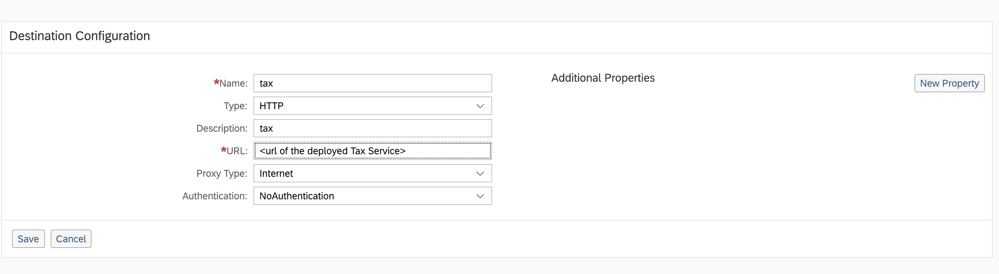<br>
       * The implementation of destination services is in [SalesOrderServiceImpl](./sale-service/src/main/java/com/sap/refapps/espm/service/SalesOrderServiceImpl.java#L214) class.

#### Deploy Service

From the tax-service folder where mta.yaml is kept for tax-service application run the command:

	  mbt build -p=cf

This will package your application to be ready for deployment.


To Deploy MTAR, run the command:

	cf deploy mta_archives/cloud-espm-cloud-native-tax_1.1.0.mtar

### Create Destination

Destination will be used by ESPM Application to consume the Tax Service which is an external service
* From the SAP CP Cockpit go to your Sub Account and click Destination

* Create a new destination by clicking `New Destination`  and filling with the properties as shown below. (URL of tax service running on SAP Cloud Platform Cloud Foundry.)
 

### Build and Deploy ESPM Application 

#### Using CF manifest
* In the root folder of project edit the manifest.yml file and update `<unique_id>` with some unique value for each applications host name
* update `QUEUE_NAME` parameter for applications  espm-sales-svc and espm-worker with value
  `"<yourorgname>/<yourmessageclientname>/<uniqueID>/salesorderqueue"`
  e.g `myorg\espm\1\salesorderqueue`

* Do a maven build of complete application from command line by running command `mvn clean install` from the projects root folder.

* Create an instance of the destination service by using the command `cf create-service destination lite espm-destination`
  
* Create new enterprise messaging service using the command:

`cf cs enterprise-messaging default espm-em -c em-default.json`

* Run command `cf marketplace` and check the service and plan names of HANA. Check if service with name `hana` and plan `schema` exists

* Create HANA DB Service instance with `schema` plan by running command  `cf create-service hana schema espm-hana-db`.

*For simplicity all the microservices are bound to one database instance espm-hana-db. If required three database instances can be created (e.g. esmp-customer, espm-product and espm-sales) and individual microservice can be bound to them*

 - Run command `cf marketplace` and check the service and plan names for the Authorization and Trust Management (XSUAA) service. Check if service `xsuaa` and plan `application` exists.

- Create a service instance of the Authorization and Trust Management service with `application` plan by running the command `cf create-service xsuaa application espm-xsuaa -c xs-security.json`. This instance is to be bound to Product Service, Sale Service and API Gateway

* Deploy Worker on to Cloud Foundry from the project root folder by running command `cf push <unique_id>-espm-worker` from CLI

* Deploy Sale Service  on to Cloud Foundry from the project root folder by running command `cf push espm-sales-svc` from CLI.

* Learn resilience patterns implemented in Sale and worker services

* Stop Sale and Worker service.

* Deploy Product Service on to Cloud Foundry from the project root folder by running command `cf push espm-product-svc` from CLI.

* Deploy Customer Service on to Cloud Foundry from the project root folder by running command `cf push espm-customer-svc` from CLI.

* Learn resilience patterns implemented in Product and Customer  services


#### Using CF deploy service

* In mta.yml update `QUEUE_NAME` parameter for modules  espm-sales-svc and espm-worker with value
  `"<yourorgname>/<yourmessageclientname>/<uniqueID>/salesorderqueue"`
  e.g `myorg\espm\1\salesorderqueue`


* From the root folder where mta.yaml is kept run the command:

	  mbt build -p=cf

This will package your application to be ready for deployment.


To Deploy MTAR, run the command:

	cf deploy mta_archives/cloud-espm-cloud-native_1.1.0.mtar


## Running the Application


### Setup Role collections

The ESPM application defines a role template called as `Retailer` and a role collection called as `Retailer-RoleCollection` in the application security description (xs-security.json). Users need this Retailer role collection to accept sales orders. Creation of sales orders can be done by anonymous users. For more information about adding roles to role collection, see [Add Roles to Role Collections](https://help.sap.com/viewer/65de2977205c403bbc107264b8eccf4b/Cloud/en-US/fe750543788a40b79a49854590ad0b11.html) in the documentation for SAP Cloud Platform.

### Assign Role to the user

We need to assign the role which we have created in the previous step to the user. For more information about assigning role collections, see [Assign Role Collections](https://help.sap.com/viewer/65de2977205c403bbc107264b8eccf4b/Cloud/en-US/9e1bf57130ef466e8017eab298b40e5e.html) in the documentation for SAP Cloud Platform.

 - In your Subaccount, navigate to Security > Trust Configuration.

 - Click on the default IDP service.

 - Enter the e-mail address of the user and choose Show Assignments.

 - Choose Assign Role Collection

 - Select the role Retailer to assign it to the user.

### Enterprise Message Queue creation
* Open Enterprise Messaging subscription in cockpit and please proceed with creating a queue with name `salesorderqueue`.
For more details about creating a queue, check [here](https://help.sap.com/viewer/bf82e6b26456494cbdd197057c09979f/Cloud/en-US/57af1bd4e8f54b0a9b36414a5ec6b800.html)

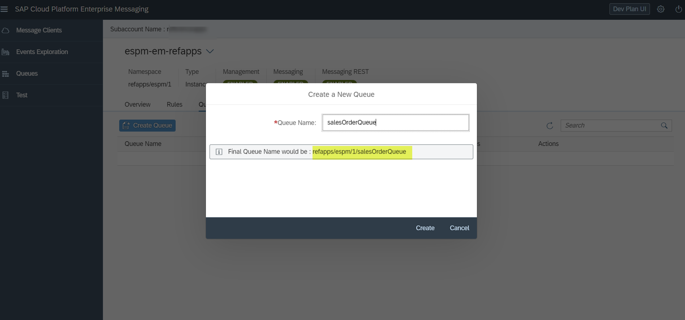

### Acessing the application UI
* From CLI run command `cf apps`
* Note down the URL for application espm-gateway. This would be appearing as xxxxx-espm-gateway.cfapps.eu10.hana.ondemand.com (if you deploy the application in an SAP CP sub account is in the Region Europe (Frankfurt))
* Launch URL for ***Webshop*** application https://xxxxx-espm-gateway.cfapps.eu10.hana.ondemand.com/webapp/webshop/index.html  
* You will be redirected to authenticate to your user.

* You will be presented with a screen where you can enter using the email address provided for a customer. The views themselves are rather simple and use databinding extensively to avoid writing lots of code. 
* Continue with paul.burke@itelo.info
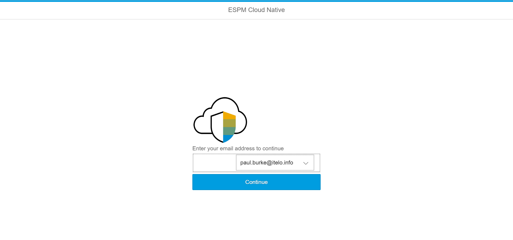
* You can do the operations like, view details of the customer, display shopping cart, display sales order, create cart, delete cart, create sales order. 
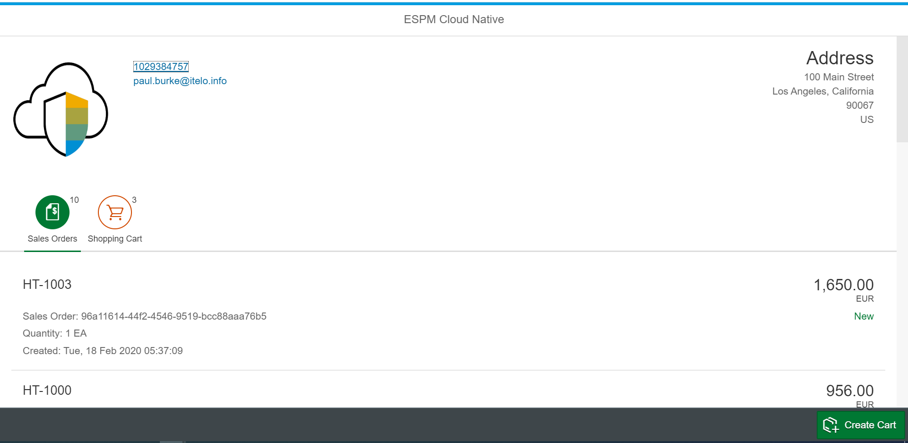
* Try to create cart by clicking on create cart and type “N” in the pop-up.
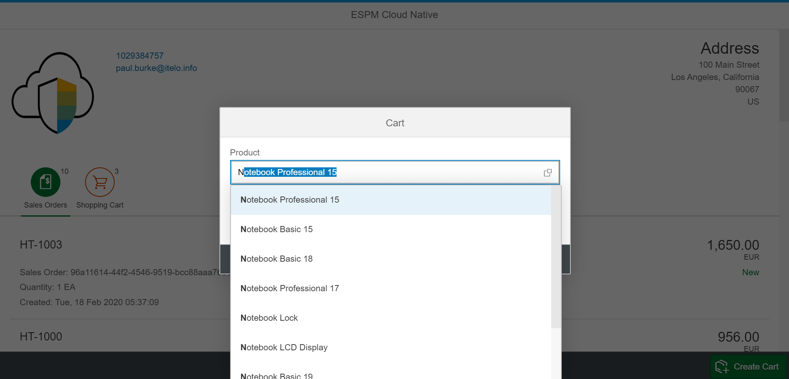
* Notice that the status of the created shopping cart is “pending”

* Try to create a Sales Order by clicking on the product in shopping cart, A pop-up will be shown with create order, delete cart or cancel the operation
* Choose Create Order
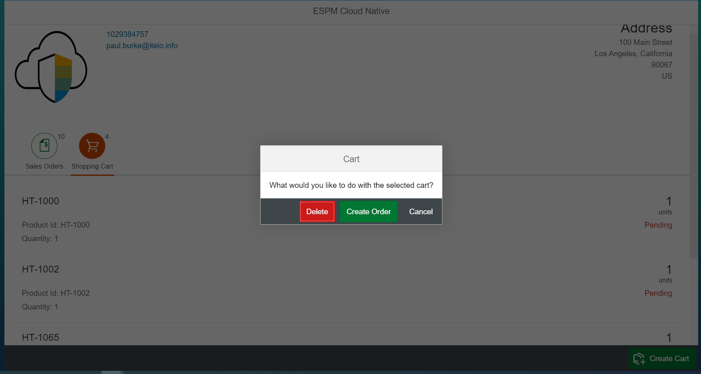
* *Sales order Successfully created* will be displayed.
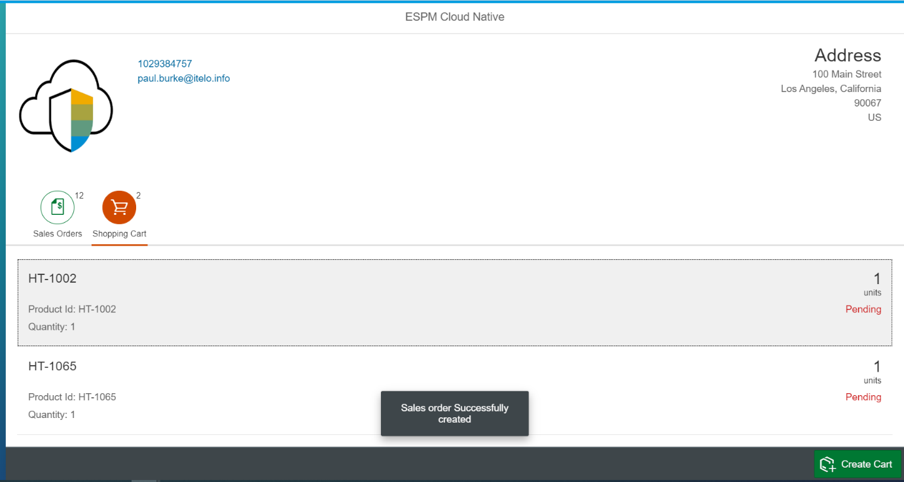
* Navigate to sales order to see the created sales order by clicking on Sales Orders tab.
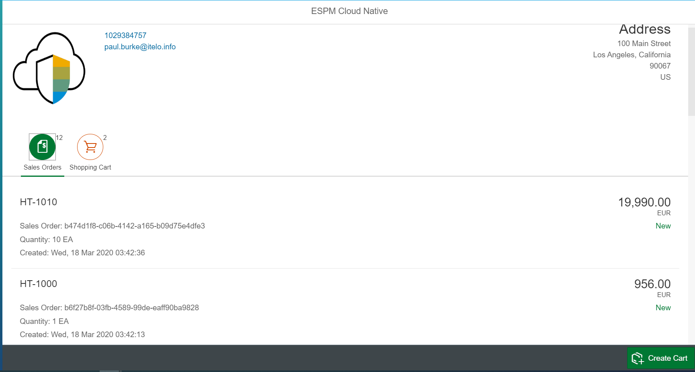
* Status of the Sales Order can be New, Rejected, Cancelled and Shipped. Notice that the status of the newly created Sales Order from Cart is “New”. 
* We can approve/reject the Sales Order from a ***Retailer View***. Launch url for retailer application https://xxxxx-espm-gateway.cfapps.eu10.hana.ondemand.com/webapp/retailer/index.html  (if your account is in the Region Europe (Frankfurt) )

* Click on *Approve Sales Orders*.
* You will be presented with a screen where Ship/ Reject a Sales Order. 
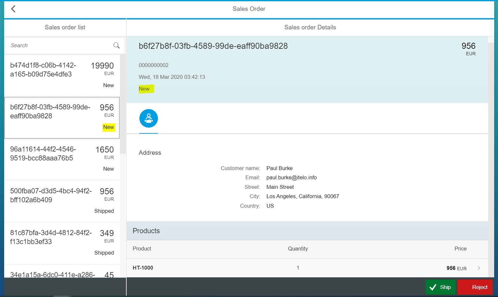
* Click on “New” sales order and see the details of the product and click on “Ship”
* You can see that the status of the sales order changed to Shipped/Rejected depending on the Stock.
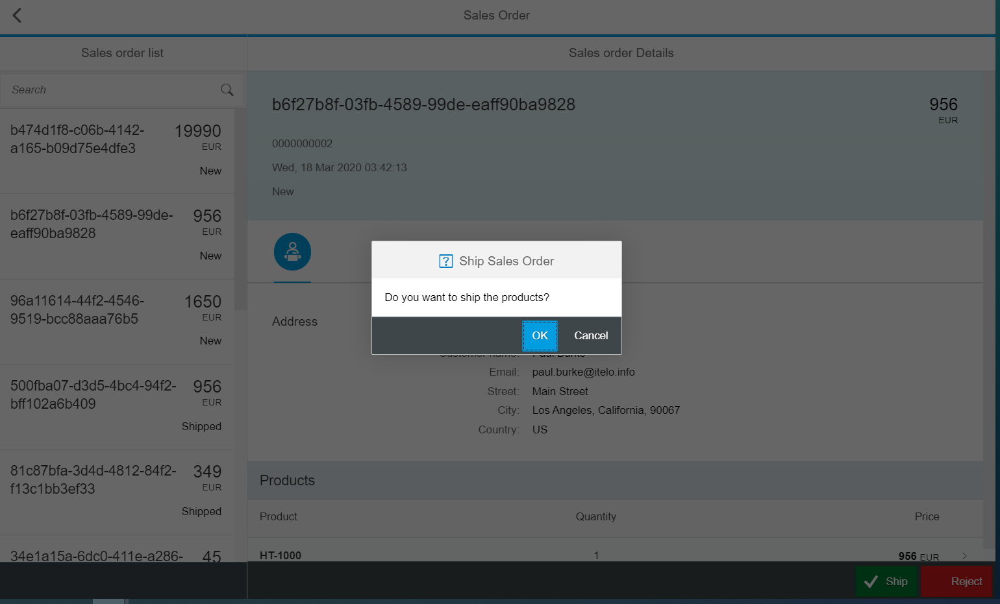
* Click on Ok.
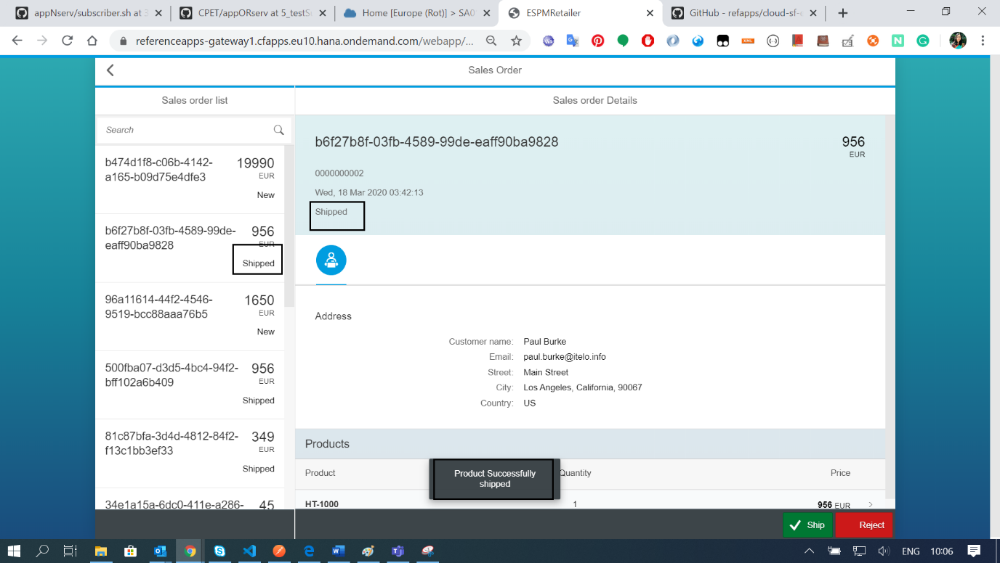
* Click on Reject in a new Sales order and When you reject the Sales Order, the status changed to Rejected.
* Following are the four different Status code.

| Lifecycle |  Life Cycle Status Name | Note |
|--|--|--|
| N | New |	When the Sales Order is created  |
| C | Cancelled | When the product is Out Of Stock |
| S | Shipped | When the Sales Order is Shipped |
| R | Rejected | When the Sales Order is Rejected by Retailer |

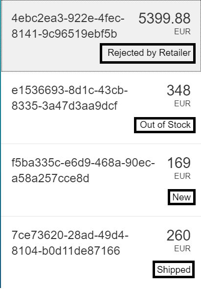


### Accessing the application API Endpoints

The below are the list of local service API endpoints of all the microservices.

#### Customer Service

| |Get Customer by Email ID |
|-|-|
| Endpoint URL 	| https://<unique_id>-espm-customer-svc.cfapps.eu10.hana.ondemand.com/customer.svc/api/v1/customers/{emailAddress} 	
| Method       	| `GET`                                                        	|


| |Create Cart |
|-|-|
| Endpoint URL 	| https://<unique_id>-espm-customer-svc.cfapps.eu10.hana.ondemand.com/customer.svc/api/v1/customers/{customerId}/carts/|
| Header       	| `Content-Type:application/json`                                        |
| Method       	| `POST`                                                                 |
| Body         	| `{"productId": "HT-1000","checkOutStatus": "false","quantityUnit": 3}`     

| |Get Cart by Customer ID |
|-|-|
| Endpoint URL 	| https://<unique_id>-espm-customer-svc.cfapps.eu10.hana.ondemand.com/customer.svc/api/v1/customers/{customerId}/carts/|
| Method       	| `GET`                                                                	 |


| |Update Cart by Item ID|
|-|-|
| Endpoint URL 	| https://<unique_id>-espm-customer-svc.cfapps.eu10.hana.ondemand.com/customer.svc/api/v1/customers/{customerId}/carts/{itemId}         
| Header       	| `Content-Type:application/json`                                                         |
| Method       	| `PUT`                                                                                   |
| Body         	| `{"itemId": {itemId},"productId": "HT-1000","quantityUnit": 10,"checkOutStatus": false}`|


| |Delete Cart by Item ID|
|-|-|
| Endpoint URL 	| https://<unique_id>-espm-customer-svc.cfapps.eu10.hana.ondemand.com/customer.svc/api/v1/customers/{customerId}/carts/{itemId}|
| Method       	| `DELETE`                                                                	 |

#### Product Service


| |Get All Products|
|-|-|
| Endpoint URL 	| https://<unique_id>-espm-product-svc.cfapps.eu10.hana.ondemand.com/product.svc/api/v1/products		 	|
| Method       	| `GET`                                                                	|

| |Get Product by Product ID|
|-|-|
| Endpoint URL 	| https://<unique_id>-espm-product-svc.cfapps.eu10.hana.ondemand.com/product.svc/api/v1/products/{productId}	 	|
| Method       	| `GET`  


In order to access the below endpoint, the user needs retailer role and token has to be passed in the header.

Execute the below command and make note of url, clientid, clientsecret.

`cf env <unique_id>-espm-product-svc`


| |Get New access Token |
|-|-|
| Access token URL 	| `<url>/oauth/token`			 |
| Client ID       	| `<clientid>`                                        |
| Client Secret       	| `<clientsecret>`                                                                 |
| Grant Type         	| `Client Credentials`          


| |Get Stock by Product ID|
|-|-|
| Endpoint URL 	| https://<unique_id>-espm-product-svc.cfapps.eu10.hana.ondemand.com/product.svc/api/v1/stocks/{productId}	 	|
| Method       	| `GET`       
| Header       	| `Content-Type:application/json` , `Authorization:Bearer <Get New Access Token>`                                |

*The stock is updated by quantity specified. e.g. if the current quantity is 50 and in the body for update stock request quantity is provided as 20 the quantity will be updated to 70*

Below URL requires the retailer role to be added to user and hence if you are executing the same from postman, make sure you have the role, and inorder to get the Access token with scopes of `Retailer` role execute the following request from postman.

| |Access token with scopes of `Retailer` role|
|-|-|
| Endpoint URL 	| Access token URL		 
| Header       	| `Content-Type:application/x-www-form-urlencoded`                                     |
| Method       	| `POST`                                                                 |
| Body        	| `x-www-form-urlencoded`

The payload of the request needs to have following form-url-encoded values:

*grant_type*: set to password to define that the client and user credentials method has to be used for the token determination

*username*: set user name of authorized user

*password*: password of the authorized user

*client_id*: the client id determined for the application

*client_secret*: the client secret determined for the application

*response_type*: set to token to indicate than an access token is requested   

| |Update Stock by Product ID|
|-|-|
| Endpoint URL 	| https://<unique_id>-espm-product-svc.cfapps.eu10.hana.ondemand.com/product.svc/api/v1/stocks/{productId}		 
| Header       	| `Content-Type:application/json`   , `Authorization:Bearer <Access token with scopes of Retailer role>`                                     |
| Method       	| `PUT`                                                                 |
| Body        	| `{"productId": "HT-1000","quantity": 20}`     

#### Sales Service

In order to access the below endpoint, the user needs retailer role and token has to be passed in the header.

Execute the below command and make note of url, clientid, clientsecret.

`cf env <unique_id>-espm-sales-svc`


| |Get New access Token |
|-|-|
| Access token URL 	| `<url>/oauth/token`			 |
| Client ID       	| `<clientid>`                                        |
| Client Secret       	| `<clientsecret>`                                                                 |
| Grant Type         	| `Client Credentials`     


| |Create Sales Order |
|-|-|
| Endpoint URL 	| https://<unique_id>-espm-sales-svc.cfapps.eu10.hana.ondemand.com/sale.svc/api/v1/salesOrders			 |
| Header       	| `Content-Type:application/json`                                 |
| Method       	| `POST`                                                                 |
| Body         	| `{"customerEmail": "viola.gains@itelo.info","productId": "HT-1000","currencyCode": "EUR", "grossAmount":956,"quantity":4}`     


| |Get Sales Order by Sales Order ID|
|-|-|
| Endpoint URL 	| https://<unique_id>-espm-sales-svc.cfapps.eu10.hana.ondemand.com/sale.svc/api/v1/salesOrders/{salesOrderId} 	|
| Method       	| `GET`       
| Header       	| `Content-Type:application/json` , `Authorization:Bearer <Get New Access Token>`                                |

| |Get Sales Order by Customer Email ID|
|-|-|
| Endpoint URL 	| https://<unique_id>-espm-sales-svc.cfapps.eu10.hana.ondemand.com/sale.svc/api/v1/salesOrders/email/{emailAddress}|
| Method       	| `GET`       
| Header       	| `Content-Type:application/json` , `Authorization:Bearer <Get New Access Token>`                                |

| |Get All Sales Order|
|-|-|
| Endpoint URL 	| https://<unique_id>-espm-sales-svc.cfapps.eu10.hana.ondemand.com/sale.svc/api/v1/salesOrders/                    |
| Method       	| `GET`       
| Header       	| `Content-Type:application/json` , `Authorization:Bearer <Get New Access Token>`                                |


## Resilience Patterns in action


### Retry
Retry patterns is implemented in Customer and Product Service to retry interactions with the database. The database might not be reachable momentarily due to network latency. But a simple retry might ensure that the next request might succeed. This ensures that the operation does not fail.
To see this pattern in action in the Customer Service, follow these steps-
* Open POSTMAN and send a GET request to fetch customer details by email address in customer service by using the given endpoint `http://localhost:9991/customer.svc/api/v1/customers/viola.gains@itelo.info`. It should return proper data if the database is up and running.
* Go to the folder where PostgreSQL is installed and navigate to the bin folder and stop the database by running this command `pg_ctl.exe -D "C:\Program Files\PostgreSQL\10\data" stop` in your terminal/command line.
* Switch to POSTMAN and send a GET request again by using the endpoint `http://localhost:9991/customer.svc/api/v1/customers/viola.gains@itelo.info`. Open command line and check the application logs. Since the database is down you may find connection errors in the stack trace.
* To veirfy whether spring-retry is working or not, search for the log `Retrying to connect to the database...` as shown in the below screenshot. There should be 2 occurances of the given log as the retry pattern in configured to make a max of 2 attempts to connect to the database when the database is down.
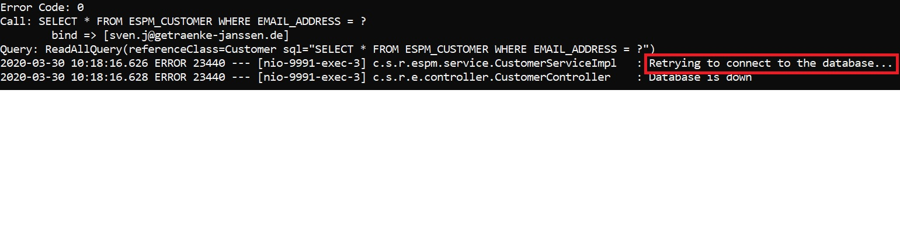
* Now re-start the database by running the command: `pg_ctl.exe -D "C:\Program Files\PostgreSQL\10\data" start`.
* Switch to POSTMAN and send a GET request again by using the endpoint `http://localhost:9991/customer.svc/api/v1/customers/viola.gains@itelo.info`. You should find proper data.

Similarly to see this pattern in action in the Product Service, follow the below steps:
* Open POSTMAN and send a GET request to fetch all products in product service by using the given endpoint `http://localhost:9992/product.svc/api/v1/products/`. It should return all the products if the database is up and running.
* Go to the folder where PostgreSQL is installed and navigate to the bin folder and stop the database by running this command `pg_ctl.exe -D "C:\Program Files\PostgreSQL\10\data" stop` in your terminal/command line.
* Switch to POSTMAN and send a GET request again by using the endpoint `http://localhost:9992/product.svc/api/v1/products/`. Open command line and check the application logs. Since the database is down you may find connection errors in the stack trace.
* To veirfy whether spring-retry is working or not, search for the log `Retrying to connect to the database...` as shown in the below screenshot. There should be 2 occurances of the given log as the retry pattern in configured to make a max of 2 attempts to connect to the database when the database is down.
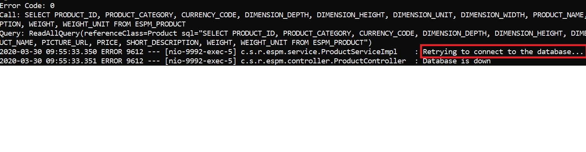
* Now re-start the database by running the command: `pg_ctl.exe -D "C:\Program Files\PostgreSQL\10\data" start`.
* Switch to POSTMAN and send a GET request again by using the endpoint `http://localhost:9992/product.svc/api/v1/products/`. You should find proper data.

### Timeout
 This pattern is implemented in Sales Service along with Circuit Breaker pattern. It's used to ensure that any request from Sales Service to Tax service does not wait indefinitely but times out after a preconfigured time for 1.2 seconds and a fall back is used for Tax calculation. To see these patterns in action, follow these steps
* Run Tax Service locally as [Spring Boot Application as mentioned](./tax-service#running-locally-as-spring-boot-application)
* Check if the Tax service URL is configured in application.properties (/sale-service/src/main/resources folder) file as `tax.service=http://localhost:9994/tax.svc/api/v1/calculate/tax?amount=`
* Run the Sale Service
* Create a Sales Order with following data using Postman
  Method : Post
  URL : http://http://localhost:9993/sale.svc/api/v1/salesOrders
  Header: `Content-Type : application/json`
  Body: `{"customerEmail": "customer1@gmail.com", "productId": "HT-1005", "currencyCode": "DLR", "grossAmount": 5000, "quantity": 2 }`

* Check if the request succeeds.
* Check that the response time would be under 1 seconds
* Stop the Tax Services which is running on SAP Cloud Platfrom Neo or on Cloud Foundry.
* Create a Sales Order with following data  
` Method : POST `    
  `URL : http://http://localhost:9993/sale.svc/api/v1/salesOrders`       
  `Header: Content-Type : application/json`  
  `Body: {"customerEmail": "customer2@gmail.com", "productId": "HT-1005", "currencyCode": "DLR", "grossAmount": 5000, "quantity": 2 } `
* The requests succeed, but takes more than 1.2 seconds this is because, since Tax service was down, the Sale Service after sending request for Tax calculation, waited for 1.2 seconds. Due to Time Out configuration and due to the Circuit Breaker implementation, it falls back to default Tax calculation implementation
* Hit get request on Sales Services

  `Method : GET`
  `URL : http://http://localhost:9993/sale.svc/api/v1/salesOrders`
* In the response it can be seen that the sales order is created with email id `customer1@gmail.com`. The first sales order created while Tax service was up will have a non-zero value for `taxAmount` field, while for the sales order created with email id `customer2@gmail.com` will have `taxAmount` as zero as the fallback `taxAmount` is set to zero

### Bounded Queue
The Sales service along with Worker implements the Bounded Queue pattern. To achieve reliable messaging, [Consumer Acknowledgement and Publisher Confirms](https://www.rabbitmq.com/confirms.html). This ensures that messages are not lost and delivered reliably to consumers. To see the pattern in action, follow these steps-
* Hit the Sales Service by running the url `http://localhost:9993/sale.svc/api/v1/salesOrders/` and POST the sales data.
	  For e.g.:
	  `{
	    "customerEmail": "customer@gmail.com",
	    "productId": "HT-1006",
	    "currencyCode": "DLR",
	    "grossAmount": 1000,
	    "quantity": 2
	  }`
	  
* Go to the folder where PostgreSQL is installed and navigate to the bin folder and stop the database by running this command `pg_ctl.exe -D "C:\Program Files\PostgreSQL\10\data" stop` in your terminal/command line.
* Again POST some data using `http://localhost:9993/sale.svc/api/v1/salesOrders/` , as Bounded Queue mechanism has been implemented, it will insert the sales order in Queue instead of throwing an error and returns an acknowledgement in the console. e.g.
	`The message with correlation ID 8f698df8-d5e1-484a-8743-23f5875c1d71 was acknowledged by the broker`
* Go to the folder where PostgreSQL is installed and navigate to the bin folder and start the database by running this command `pg_ctl.exe -D "C:\Program Files\PostgreSQL\10\data" start` in your terminal/command line.
* Now as the database is up, the Worker will pick the job from queue and push it into database, verify it by hitting `http://localhost:9993/sale.svc/api/v1/salesOrders/`

### Unit Isolation
ESPM has a  microservice based architecture, where all the services are independent of each other  and have been isolated against each other here by bringing in Unit Isolation.


### Circuit Breaker
In ESPM this pattern is showcased via sale service. This service needs to compute the tax amount for a Sales Order. This is done by hitting an external [Tax Service](./tax-service). If the Tax Service is unreachable, instead of throwing an error, a fallback mechanism executes the logic and default tax value is returned. Resilience 4j library is used to implement Circuit breaker patterns.
To see the pattern in action follow these steps-
* Navigate to tax-service folder
* Run the application [Locally as Spring Boot Application](./tax-service/README.md#running-locally-as-spring-boot-application)
*  Hit the Sales Service by running the url `http://localhost:9993/sale.svc/api/v1/salesOrders/` and POST the sales data.
	  For e.g.:
	  `{
	    "customerEmail": "customer@gmail.com",
	    "productId": "HT-1006",
	    "currencyCode": "DLR",
	    "grossAmount": 1000,
	    "quantity": 2
	  }`
* Now hit the Sales Service by running the url `http://localhost:9993/sale.svc/api/v1/salesOrders/email/customer@gmail.com` and check whether it returns the data, which includes 2 additional attributes `netAmount` & `taxAmount`.
* Now Stop the Tax Service which is running locally, which means that the Tax Service endpoint will be unreachable.
* Again, POST some data using `http://localhost:9993/sale.svc/api/v1/salesOrders/`.
* Normally, this POST method should fail as the endpoint of Tax Service is unreachable but as Circuit Breaker pattern is implemented, instead of throwing error, a fallback mechanism is executed which in turn gives default tax value when the Tax Service is down.
* Now when you start your Tax Service, endpoint becomes reachable and normal flow is resumed.


### Shed Load

Shed Load pattern to limit the rate of request handling is implemented in the Product and the Customer Service. The same can be implemented on Sales Service but since the implementation is same it has not been implemented in the Sales Service.

The strategy to Shed Load, implemented in Customer and Product Service is to limit the concurrent requests. The simple and efficient way to limit the concurrent requests is to implement a [Semaphore](https://docs.oracle.com/javase/8/docs/api/java/util/concurrent/Semaphore.html). Now that the concurrent requests can be rate limited, HTTP requests needs to be filtered. There multiple approaches to solve this problem. It could be solved via a [servlet filter](https://docs.oracle.com/javaee/7/api/javax/servlet/Filter.html) or a [tomcat valve](https://tomcat.apache.org/tomcat-8.5-doc/api/org/apache/catalina/Valve.html). Tomcat valve has been chosen to solve the problem of filtering the HTTP requests because filtering / rejecting happens very early in the request processing chain i.e. even before requests enters servlet context. Since its implemented at the Tomcat Container level, it ensures that all servlets/api endpoints are rate limited.

*Currently all api endpoints have same rate limitation with respect maximum concurrent request which can be handled. The number of concurrent requests that can be handled is configured based on the max.requests property in the application.properties. This can be modified to have separate rate limitation for each api endpoint by having URL pattern matching in the Shed Load implementation.*

Each application component must decide how many concurrent threads it can allow.

To see the Shed Load Pattern in action we will use Apache JMeter as performance benchmarking tool.
* Download [Apache JMeter](https://jmeter.apache.org/download_jmeter.cgi).
* Launch Apache JMeter by running /bin/jmeter.bat or /bin/jmeter.sh (based on your Operating System)
* The number of concurrent request that can be handled by Customer or Product Service is configured in application.properties(/product-service/src/main/resources/) file via parameter `max.requests`.  Each component based on analysis after performance test must decide how many concurrent requests it can handle.
* If this value is changed from default value do a maven build of the application and deploy it locally or on Cloud Foundry
* Open the Apache JMeter scripts CustomerServiceShedLoadTest.jmx or ProductServiceShedLoadTest.jmx located in the benchmark folder in Apache JMeter, to test Shed Load pattern implementation in Customer Service or Product Service respectively.
* Modify the Apache JMeter script by enabling the Config Element ` Localhost` and disabling the Config Element `Cloud Foundry` if you plan to run the JMeter script against the local deployment of the application. Vice versa if you plan to run the JMeter script against the application endpoint deployed on Cloud Foundry.
* Modify `Server Name or IP` and `Port` parameters in elements `HTTP Request Defaults: Localhost` or `HTTP Request Defaults: Cloud Foundry` based on your applications endpoints.
* Run the Apache JMeter scripts and analyze the HTTP responses via the `All Responses ` element in JMeter.
*  When the system is overloaded you will observe requests being rejected with status HTTP 503 (Service Unavailable)


## Known issues

None

## Support

Please use GitHub [issues](https://github.com/SAP-samples/cloud-espm-cloud-native/issues/new) for any bugs to be reported.

## License

Copyright (c) 2018 SAP SE or an SAP affiliate company. All rights reserved.
This project is licensed under the SAP Sample Code License Agreement except as noted otherwise in the [LICENSE](SAP_Sample_Code_License_Agreementv1.0.docx) file.
