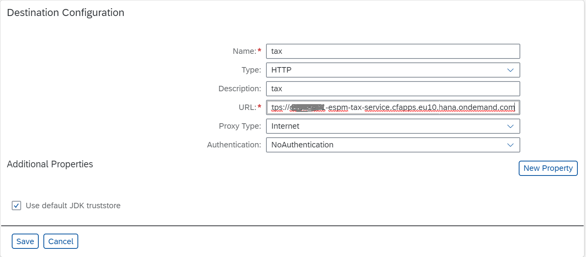

## Configure Role Collections and set up Destinations

The ESPM application defines a role template called as `Retailer` and a role collection called as `Retailer-RoleCollection` in the application security descriptor (xs-security.json). Users need this Retailer role collection to accept sales orders. Creation of sales orders can be done by anonymous users. For more information about adding roles to role collection, see [Add Roles to Role Collections](https://help.sap.com/viewer/65de2977205c403bbc107264b8eccf4b/Cloud/en-US/fe750543788a40b79a49854590ad0b11.html) in the documentation for SAP Business Technology Platform.

#### Assign Role to the user

We need to assign the role which we have created in the previous step to the user. For more information about assigning role collections, see [Assign Role Collections](https://help.sap.com/viewer/65de2977205c403bbc107264b8eccf4b/Cloud/en-US/9e1bf57130ef466e8017eab298b40e5e.html) in the documentation for SAP Business Technology Platform.

 - In your Subaccount, navigate to Security > Users.

 - Enter the e-mail address of the user in search bar, select and Expand.

 - Choose Assign Role Collection.

 - Select the required Retailer role to assign it to the user.
 
#### Create Destination

Destination will be used by ESPM Application to consume the Tax Service which is an external service.
* From the SAP BTP Cockpit go to your Sub Account and click Destination.

* Create a new destination by clicking `New Destination`  and filling with the properties as shown below. (URL of tax service running on SAP Business Technology Platform.)

 
