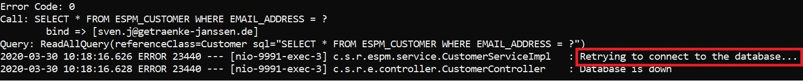
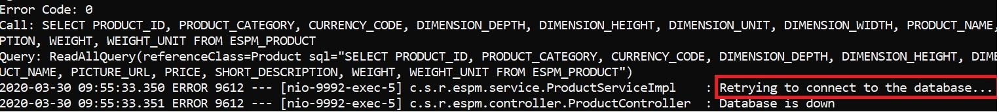

## Resilience Patterens in Action - Retry

Retry patterns is implemented in Customer and Product Service to retry interactions with the database. The database might not be reachable momentarily due to network latency. But a simple retry might ensure that the next request might succeed. This ensures that the operation does not fail. To see this pattern in action in the Customer Service, follow these steps-
* Open POSTMAN and send a GET request to fetch customer details by email address in customer service by using the given endpoint `http://localhost:9991/customer.svc/api/v1/customers/viola.gains@itelo.info.` It should return proper data if the database is up and running.
* Go to the folder where PostgreSQL is installed and navigate to the bin folder and stop the database by running this command `pg_ctl.exe -D "C:\Program Files\PostgreSQL\10\data" stop` in your terminal/command line.
* Switch to POSTMAN and send a GET request again by using the endpoint `http://localhost:9991/customer.svc/api/v1/customers/viola.gains@itelo.info.` Open command line and check the application logs. Since the database is down you may find connection errors in the stack trace.
* To verify whether spring-retry is working or not, search for the log Retrying to connect to the database... as shown in the below screenshot. There should be 2 occurances of the given log as the retry pattern in configured to make a max of 2 attempts to connect to the database when the database is down.

* Now re-start the database by running the command: `pg_ctl.exe -D "C:\Program Files\PostgreSQL\10\data" start.`
* Switch to POSTMAN and send a GET request again by using the endpoint  `http://localhost:9991/customer.svc/api/v1/customers/viola.gains@itelo.info.` You should find proper data.

Similarly to see this pattern in action in the Product Service, follow the below steps:

* Open POSTMAN and send a GET request to fetch all products in product service by using the given endpoint `http://localhost:9992/product.svc/api/v1/products/.` It should return all the products if the database is up and running.
* Go to the folder where PostgreSQL is installed and navigate to the bin folder and stop the database by running this command `pg_ctl.exe -D "C:\Program Files\PostgreSQL\10\data" stop` in your terminal/command line.
* Switch to POSTMAN and send a GET request again by using the endpoint `http://localhost:9992/product.svc/api/v1/products/.` Open command line and check the application logs. Since the database is down you may find connection errors in the stack trace.
* To verify whether spring-retry is working or not, search for the log Retrying to connect to the database... as shown in the below screenshot. There should be 2 occurrences of the given log as the retry pattern in configured to make a max of 2 attempts to connect to the database when the database is down.

* Now re-start the database by running the command: `pg_ctl.exe -D "C:\Program Files\PostgreSQL\10\data" start.`
* Switch to POSTMAN and send a GET request again by using the endpoint `http://localhost:9992/product.svc/api/v1/products/. You should find proper data.`
