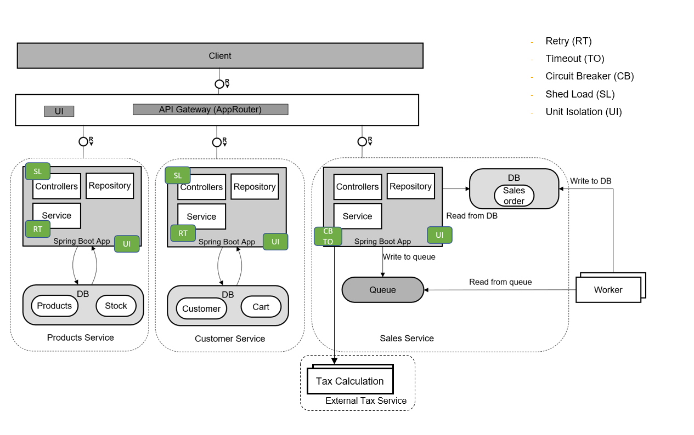

## Description
The main intent of the scenario is to showcase how **Resilience patterns** can be implemented in a Cloud Native application. The current scope of the application showcases the below resilience patterns.

-	Retry
-	Timeout
-	Circuit Breaker
-	Shed Load
-	Unit Isolation

These patterns are showcased through implementing a business scenario of an eCommerce site that sells electronic products. The eCommerce site supports two personas.

 1. A Customer, who can order Products

 2. A Retailer who can then accept the Sales Orders created by the customer. The Retailer can also update the Product Stock information.

## Architecture
The ESPM Application is built based on microservices architecture principles. Each microservice is built as a Spring Boot application and runs on SAP BTP, Cloud Foundry runtime. It consumes platform services like SAP Event Mesh, Authorization and Trust Management, SAP HANA Cloud and Connectivity.

## Requirements
You can find all requirements to execute the tutorial in section [Prerequisites and Required Systems](../../prepare/mission-prerequisites/README.md).

## Known issues
Currently, there are no known issues for the tutorial project.

## Support

Please use GitHub [issues](https://github.com/SAP-samples/cloud-espm-cloud-native/issues/new) for any bugs to be reported.
	

## License

Copyright (c) 2020 SAP SE or an SAP affiliate company. All rights reserved. This project is licensed under the Apache Software License, version 2.0 except as noted otherwise in the [LICENSE](https://github.com/SAP-samples/cloud-espm-cloud-native/blob/main/LICENSES/Apache-2.0.txt) file.

