## Excecute the ESPM Application

* From CLI run command `cf apps`
* Note down the URL for application espm-gateway. This would be appearing as <unique_id>-espm-gateway.cfapps.eu10.hana.ondemand.com (if you deploy the application in an SAP BTP sub account is in the Region Europe (Frankfurt))
* Launch URL for ***Webshop*** application https://<unique_id>-espm-gateway.cfapps.eu10.hana.ondemand.com/webapp/webshop/index.html  
* You will be redirected to authenticate to your user.
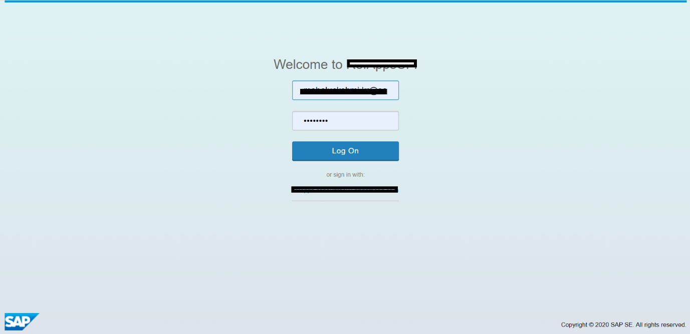
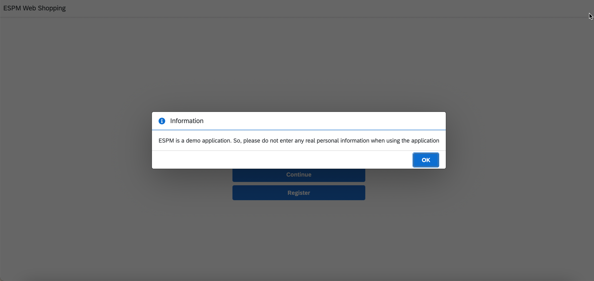
* You will be presented with a screen where you can enter using the email address provided for a customer. You can use existing customer email or you can register a new customer.
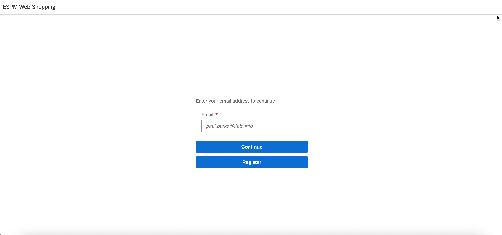
* Continue with eg: paul.burke@itelo.info / viola.gains@itelo.info
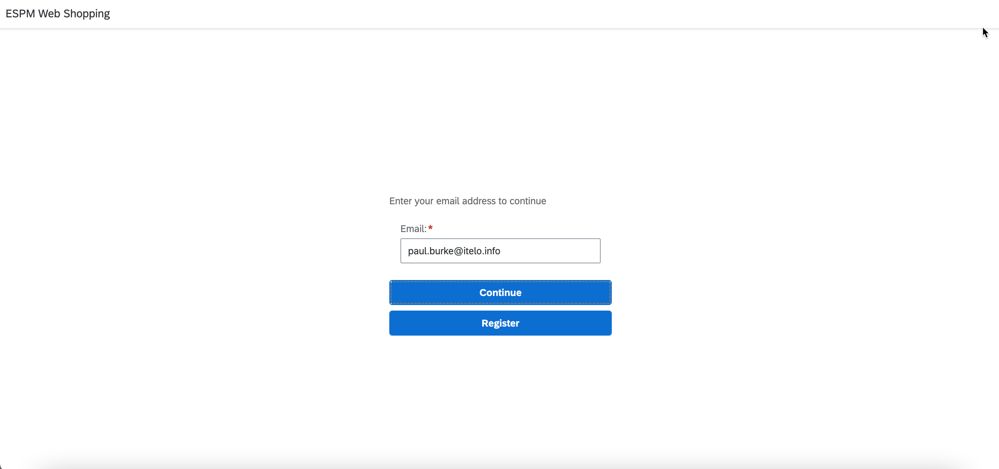
* View all Products details. 
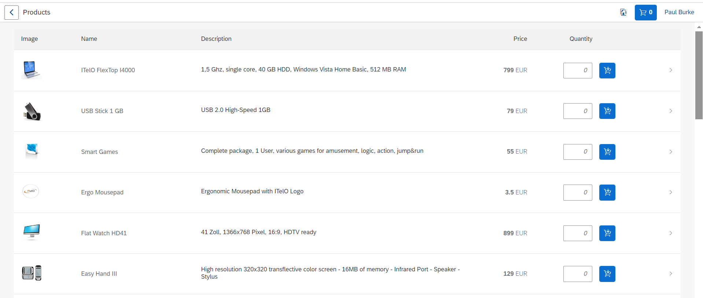
* You can edit the number of quantity by entering the number in the column. Click on add to cart.
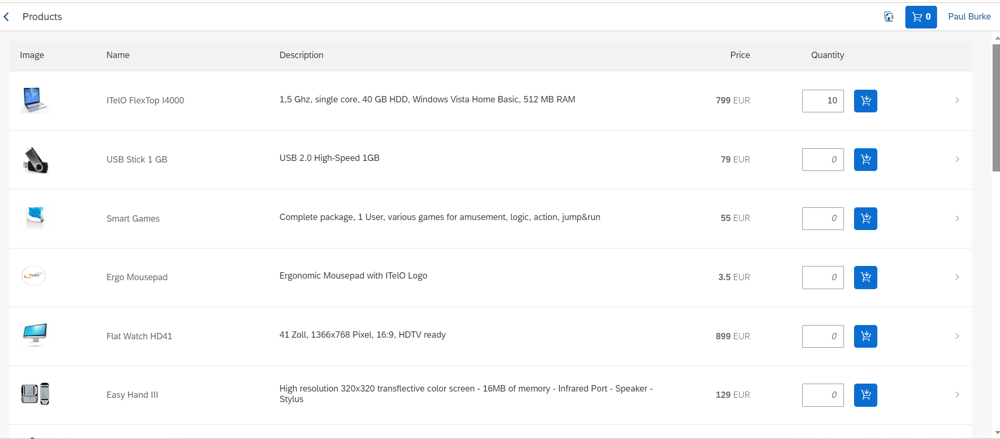
* Click on Add to cart, if quantity is not added, minimum of 1 item is taken.
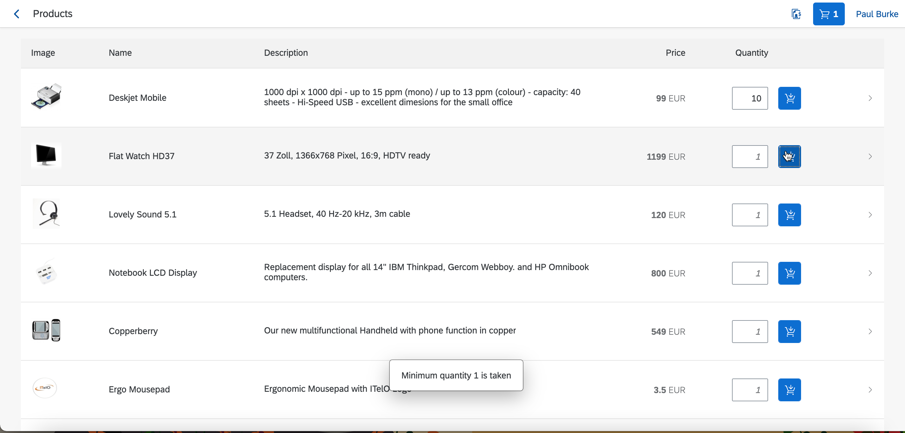
* Click on Cart icon on top right to checkout your order.
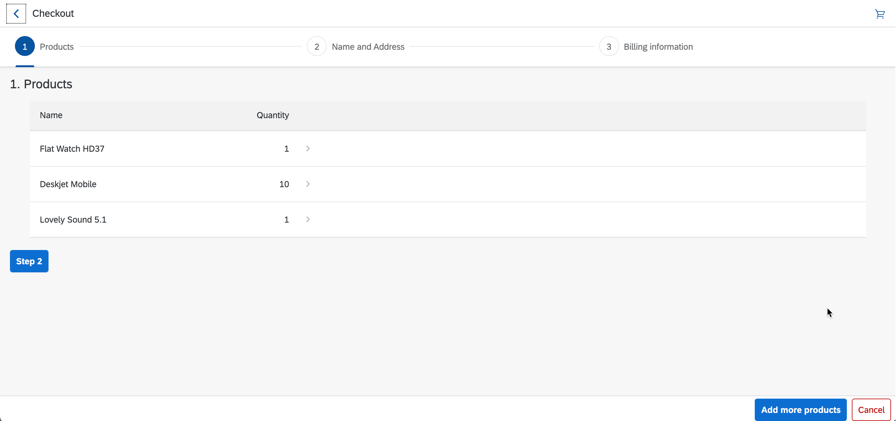
* You are presented with a screen with all added cart items. Click on Step 2. You can see your logged in email.
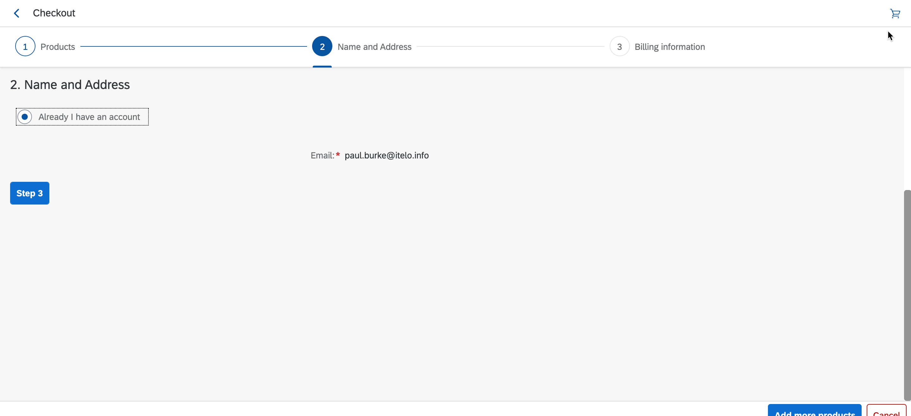
* Add dummy credit card information. Please do not enter real information. You can add more products or you can cancel the checkout operation.
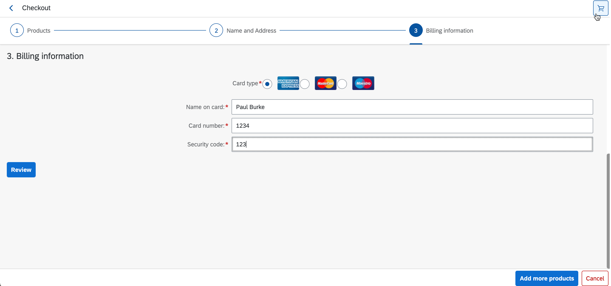
* Click on Review. You can see all the details. Click on Place Order to place the order.
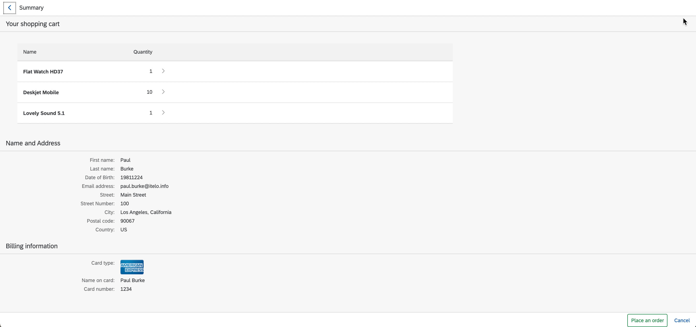
* You can see the sales order information by clicking the top right second icon near cart icon.
* Status of the Sales Order can be New, Rejected, Cancelled and Shipped. Notice that the status of the newly created Sales Order from Cart is “New”.
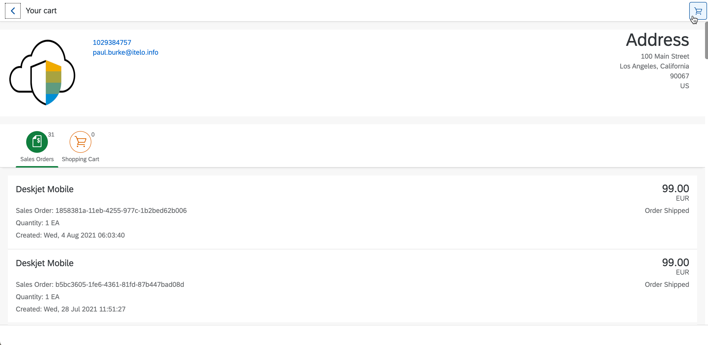
* Similarly, this page also shows cart details in a tab.
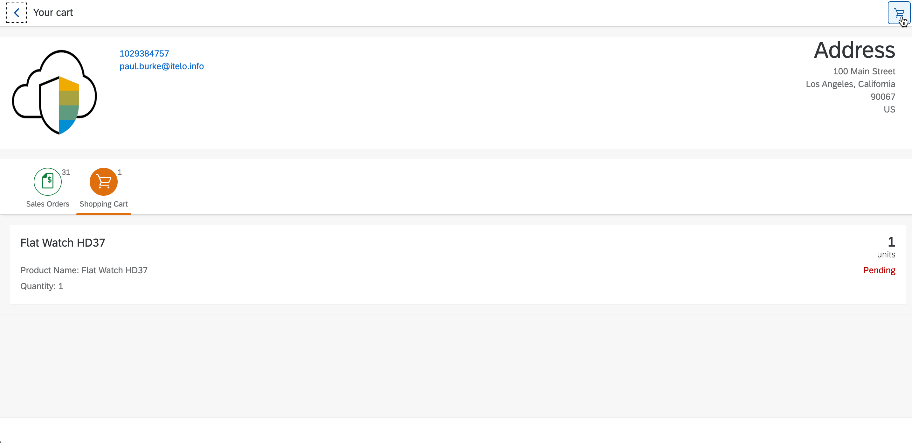
* This completes the webshopping. More, you can register yourself and follow the same process to place an order.
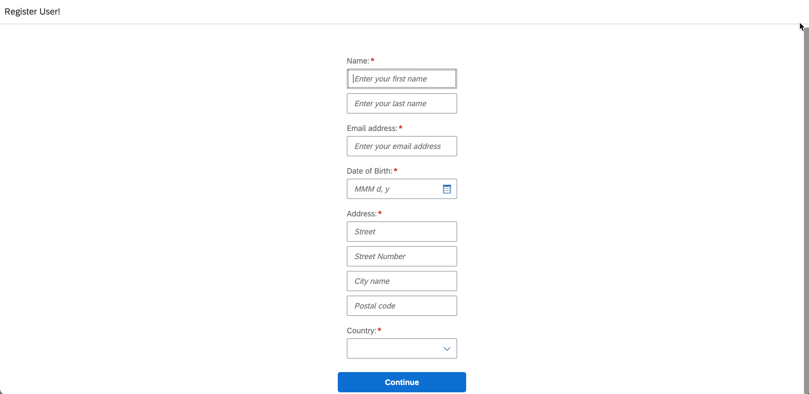
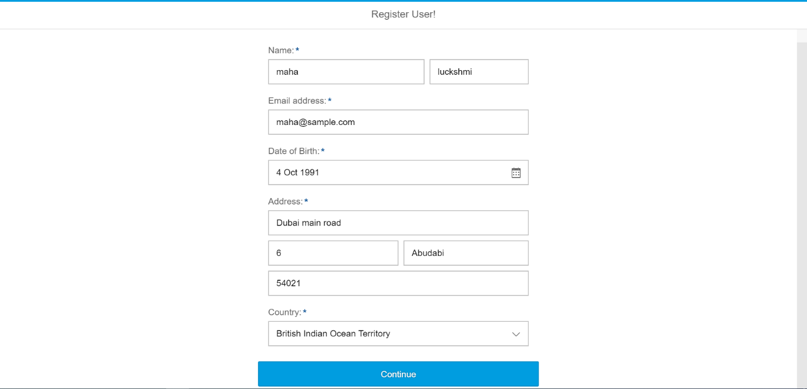
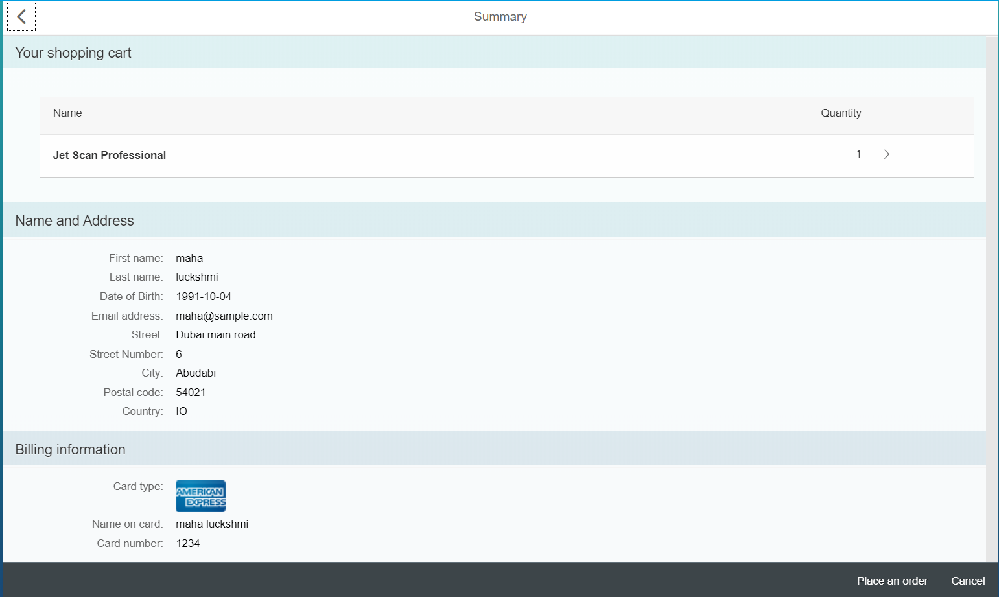
* We can approve/reject the Sales Order from a ***Retailer View***. Launch url for retailer application https://xxxxx-espm-gateway.cfapps.eu10.hana.ondemand.com/webapp/retailer/index.html  (if your account is in the Region Europe (Frankfurt) )
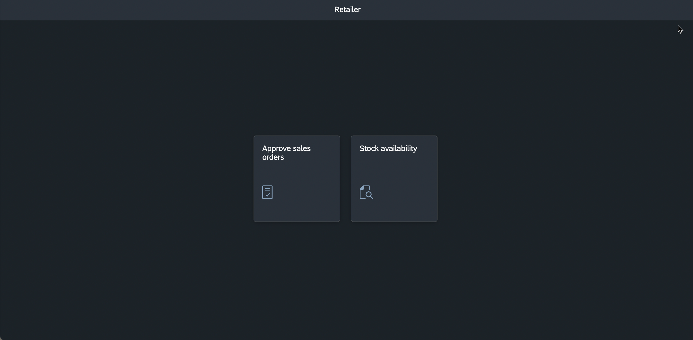
* View both product and stock information in *Stock Information* page.
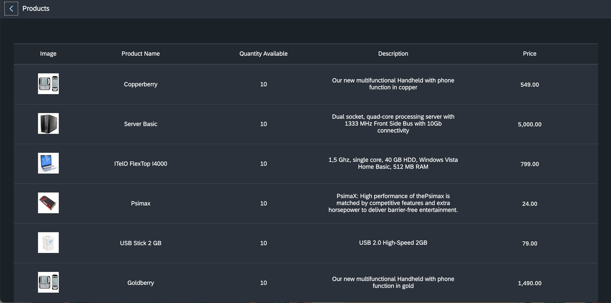
* Click on *Approve Sales Orders*.
* You will be presented with a screen where Ok/Cancel to Approve Sales Order.
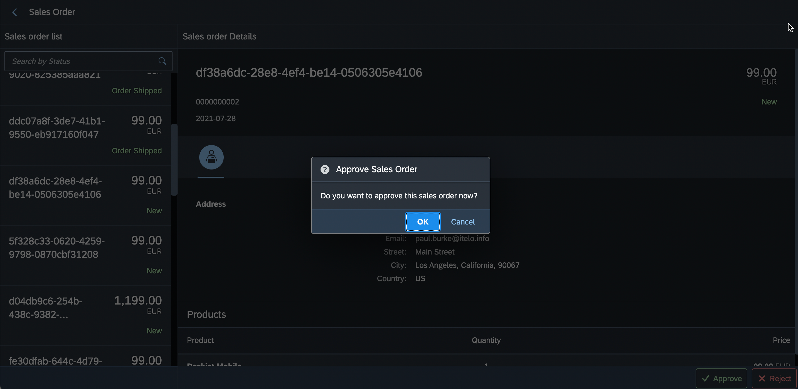
* Click on “New” sales order and see the details of the product and click on “Ship”
* You can see that the status of the sales order changed to Shipped/Rejected depending on the Stock.
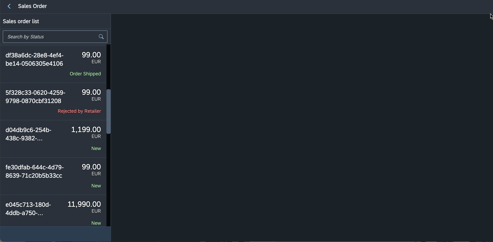

* Click on Reject in a new Sales order and When you reject the Sales Order, the status changed to Rejected.
* Following are the four different Status code.

| Lifecycle |  Life Cycle Status Name | Note |
|--|--|--|
| N | New |	When the Sales Order is created  |
| C | Out of Stock | When the product is Out Of Stock |
| S | Order Shipped | When the Sales Order is Shipped |
| R | Rejected By Retailer | When the Sales Order is Rejected by Retailer |

* You can also search sales orders by status name.
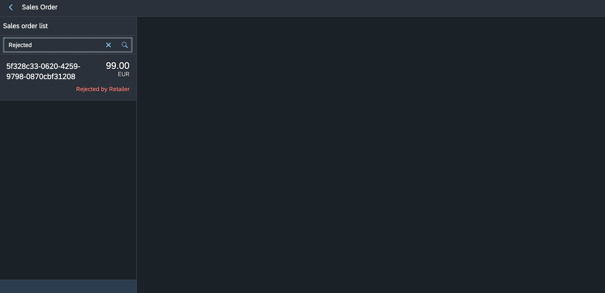

