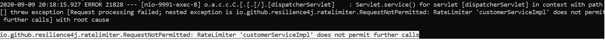

### Resilience Patterns in Action 
#### Shed Load

Shed Load pattern basically helps to limit the rate of request handling and is implemented in the Product and the Customer Service. .

The strategy to Shed Load is to limit the concurrent requests. The pattern is implemented in two different ways:
 - Using Semaphore in Prodcut service.
 - Using Resilience4j RateLimiter in Customer service.

#### Semaphore
The simple and efficient way to limit the concurrent requests is to implement a [Semaphore](https://docs.oracle.com/javase/8/docs/api/java/util/concurrent/Semaphore.html). Now that the concurrent requests can be rate limited, HTTP requests needs to be filtered. There multiple approaches to solve this problem. It could be solved via a [servlet filter](https://docs.oracle.com/javaee/7/api/javax/servlet/Filter.html) or a [tomcat valve](https://tomcat.apache.org/tomcat-8.5-doc/api/org/apache/catalina/Valve.html). Tomcat valve has been chosen to solve the problem of filtering the HTTP requests because filtering / rejecting happens very early in the request processing chain i.e. even before requests enters servlet context. Since its implemented at the Tomcat Container level, it ensures that all servlets/api endpoints are rate limited.

*Currently all api endpoints have same rate limitation with respect to maximum concurrent request which can be handled. The number of concurrent requests that can be handled is configured based on the max.requests property in the application.properties. This can be modified to have separate rate limitation for each api endpoint by having URL pattern matching in the Shed Load implementation.*

Each application component must decide how many concurrent threads it can allow.

To see the Shed Load Pattern in action using semaphore, we will use Apache JMeter as performance benchmarking tool.
* Download [Apache JMeter](https://jmeter.apache.org/download_jmeter.cgi).
* Launch Apache JMeter by running /bin/jmeter.bat or /bin/jmeter.sh (based on your Operating System)
* The number of concurrent request that can be handled by Product Service is configured in application.properties(/product-service/src/main/resources/) file via parameter `max.requests`.  Each component based on analysis after performance test must decide how many concurrent requests it can handle.
* If this value is changed from default value do a maven build of the application and deploy it locally or on Cloud Foundry.
* Open the Apache JMeter scripts ProductServiceShedLoadTest.jmx located in the benchmark folder in Apache JMeter, to test Shed Load pattern implementation in Product Service.
* Modify the Apache JMeter script by enabling the Config Element ` Localhost` and disabling the Config Element `Cloud Foundry` if you plan to run the JMeter script against the local deployment of the application. Vice versa if you plan to run the JMeter script against the application endpoint deployed on Cloud Foundry.
* Modify `Server Name or IP` and `Port` parameters in elements `HTTP Request Defaults: Localhost` or `HTTP Request Defaults: Cloud Foundry` based on your applications endpoints.
* Run the Apache JMeter scripts and analyze the HTTP responses via the `All Responses ` element in JMeter.
* When the system is overloaded you will observe requests being rejected with status HTTP 503 (Service Unavailable)

#### Resilience4j-RateLimiter
The [RateLimiter](https://resilience4j.readme.io/docs/ratelimiter) pattern from resilience4j library is another very effective way to limit the rate of concurrent requests. This approach is implemented in Customer service. The ratelimiter is configured using three properties:
  - limitForPeriod (denotes how many number of calls are permitted in a given refresh period, default is 50.
  - limitRefreshPeriod (the period to refresh the permission limit, default is 500ns(ns - nanosec)).
  - timeoutDuration (indicates how long a thread/request can wait to acquire permission, default is 5sec)

To see the Shed Load Pattern in action using resilience4j ratelimiter, we will again use JMeter as performance benchmarking tool.
* Launch Apache JMeter by running /bin/jmeter.bat or /bin/jmeter.sh (based on your Operating System)
* The default configuration of ratelimiter is overriden in Customer service. The total number of calls that are permitted in a refresh period is configured to 5. The refresh period is kept as 1s so after every 1s the permission of call will be refreshed. The timeout duration is configured to 500ms or 0.5s. So when the duration times out, it will start rejecting the requests untill the refresh period refreshed the permission again.
* Open the Apache JMeter scripts CustomerServiceRateLimiterTest.jmx located in the benchmark folder in Apache JMeter, to test Shed Load pattern implementation in Customer service.
* Modify the Apache JMeter script by enabling the Config Element ` Localhost` and disabling the Config Element `Cloud Foundry` if you plan to run the JMeter script against the local deployment of the application. Vice versa if you plan to run the JMeter script against the application endpoint deployed on Cloud Foundry.
* Modify `Server Name or IP` and `Port` parameters in elements `HTTP Request Defaults: Localhost` or `HTTP Request Defaults: Cloud Foundry` based on your applications endpoints.
* Run the Apache JMeter scripts and analyze the HTTP responses via the `All Responses ` element in JMeter.
* When the system is overloaded you will observe requests being rejected in jemeter. Open the application logs and check for the following error logs as shown: 
