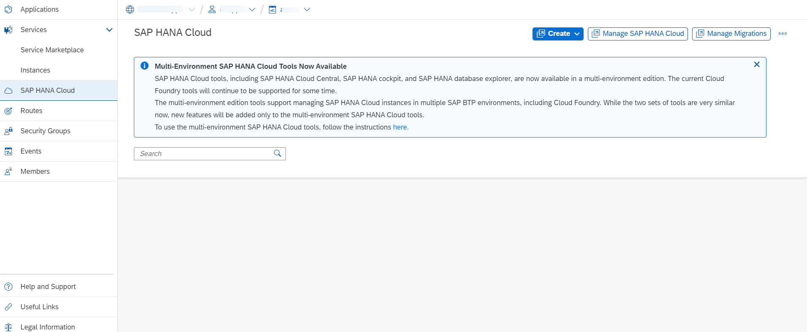
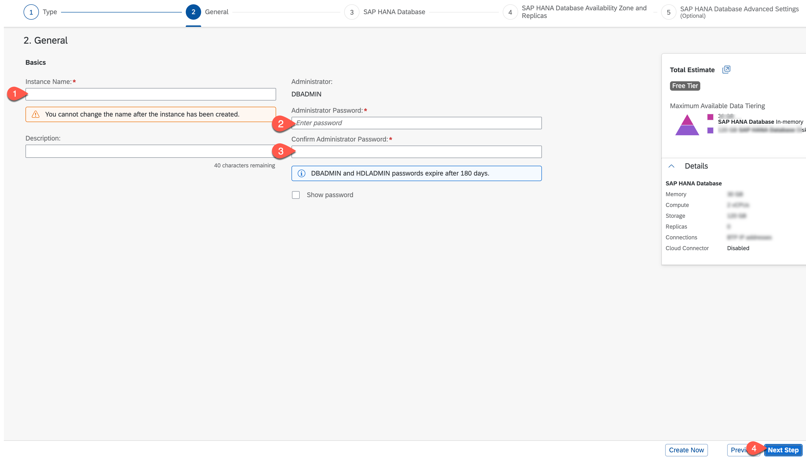
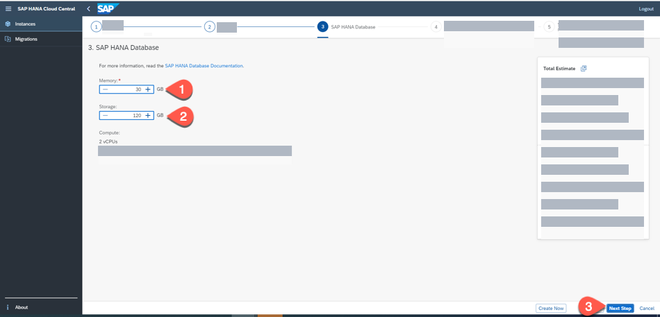
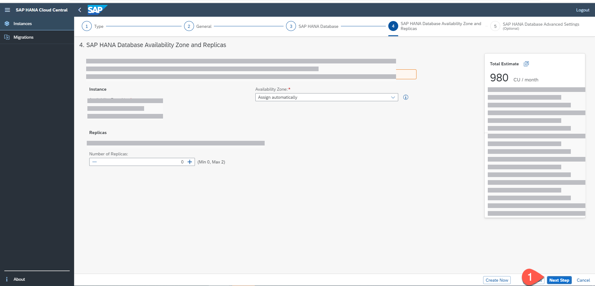
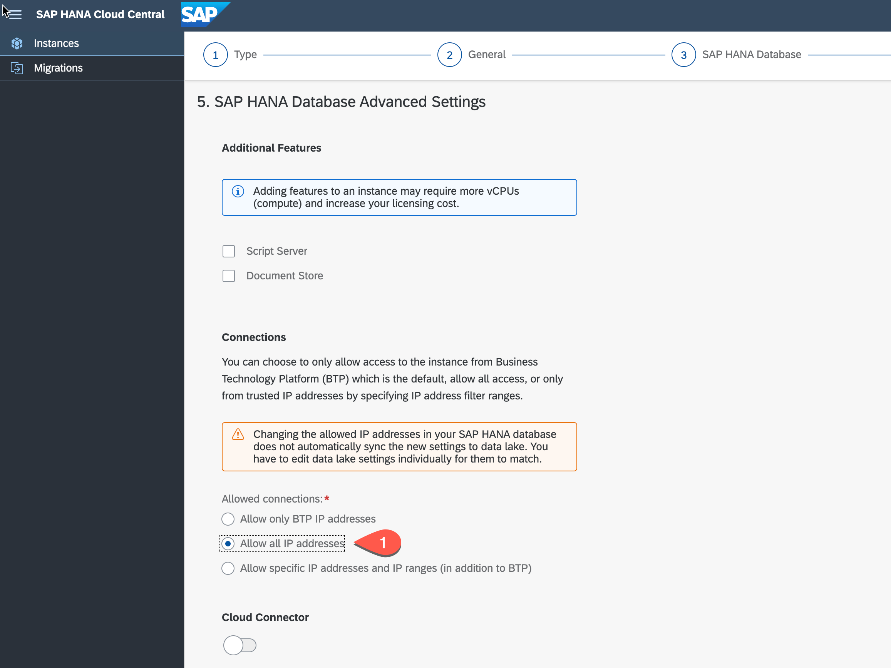
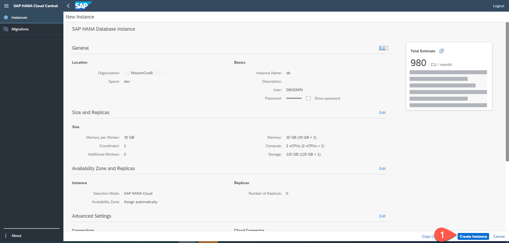

# Create an SAP HANA Cloud Instance

For this mission, we will use SAP HANA Cloud as our persistence layer.

>  If the SAP HANA cloud instance is present in another space share with your space as described [here](https://help.sap.com/viewer/cc53ad464a57404b8d453bbadbc81ceb/Cloud/en-US/390b47b7c0314d57a1829a0759a71ace.html)  if not Use the following steps to create an SAP HANA Cloud instance on SAP BTP:

1. In SAP BTP cockpit, enter your global account, subaccount, and space.

    On the menu on left-side of the screen, click on SAP HANA Cloud.

    

2. You will be logged in to SAP HANA Cloud Central. Choose **Create Instance**.

3.  Choose the type of SAP HANA Cloud instance as **SAP HANA Cloud, SAP HANA Database** and select **Next Step**.

   

4. In the next tab, Enter an **Instance name**, enter a valid database **Administrator Password**, **confirm Administrator Password** and select **Next Step**.

   

5. Select the **Memory** and **Storage** capacity for your SAP HANA Cloud database instance. For this mission, you can choose the minimum capacity and select **Next Step**.

   

6. In the tab for Availability Zone and Replicas, you can leave the defaults and choose **Next Step**.

   

7. In the tab for SAP HANA Advanced Settings, choose **Allow all IP Addresses** and choose **Review and Create**.

   

8. Choose **Create Instance** to create an instance of SAP HANA Cloud Database instance.

    

    The creation of the instance will take some minutes.
    
 9. Follow steps in [Map an SAP HANA Database to another Environment Context](https://help.sap.com/docs/HANA_CLOUD/9ae9104a46f74a6583ce5182e7fb20cb/1683421d02474567a54a81615e8e2c48.html) to map SAP BTP Cloud Foundry Runtime to SAP HANA Cloud instance. 
  

